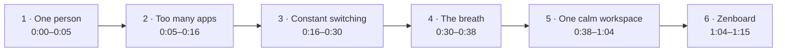

# Zenboard Launch Film — Creative Direction

Sep 25, 2026 · @divya

## 1. What's breaking the current cut

The current cut runs 1:48 and uses four separate visual worlds, so Zenboard never feels like one product. The ideas are good; the system around them is missing. Target runtime for the new film is 1:15.

| Problem | Where it shows up | Fix in this direction |
| --- | --- | --- |
| Four visual worlds | Cream editorial pages, black UI with magenta glow, pastel illustrated tile wall, pink gradient flow diagram | One surface (Paper) for the whole film; the product lives on it, not in a different world |
| Two type voices | Grotesk headlines plus a pink italic serif for emphasis | Geist only; emphasis through weight and colour, never a second typeface |
| Magenta everywhere | Chaos scenes, logo glow, UI, flow diagram all use it | Magenta is withheld until Zenboard appears; it becomes the reward |
| Too many headlines | Roughly 20 separate lines of copy | 15 short lines total, one per scene, most under 7 words |
| Collisions and clutter | Scattered "again" words, overlapping floating cards, dense tile wall | Chaos is shown through tempo (switching), not through piling objects on top of each other |
| Mixed illustration styles | Orange avatar circle, scribbles on beige squares, pastel 3D-ish tiles | One line-illustration style with a single flat tint, defined in section 7 |
| Light-to-dark hard cut | "What if it..." jumps to a black world | The transformation happens on the same surface: the noise leaves, the space stays |
| Feature tour feels like a list | Plan / Write / Invoice / Portal / Life / Connected are separate vignettes | One client job travels through every module, so features read as one connected story |

## 2. The big idea: One Surface

The whole film happens on one calm surface; the only thing that changes is how much noise is on it. We start with a clear desk, fill it with apps, switch between them faster and faster, then let the noise leave. What remains is Zenboard. The viewer should feel the transformation before they read it.

**The one-line story:** One person, one idea, eight apps, endless switching, then one calm place for all of it.

**Three rules that make it one film:**

1. **Same surface, start to finish.** Paper background from frame 1 to the end card. No black world, no gradient world.
2. **Chaos is tempo, not clutter.** The problem is shown through speed of switching and sound, never through overlapping objects. Every frame stays clean, even the chaotic ones.
3. **Magenta is earned.** Chaos is monochrome (ink and stone grey). Magenta appears for the first time as the Zenboard mark, then only on Zenboard things.



The emotional curve rises through acts 2 and 3, peaks at the last switch, drops to silence in act 4, then settles into a steady, warm rhythm. Acts 1 and 6 mirror each other: the same founder at the same desk, morning then evening.

## 3. Film brand system

Five colours, one typeface, one grid. Anything not in this section does not go in the film.

### Colour

All colours now come from the Zenboard illustration palette. The film uses a small base set on every frame. Category colours are held back until Zenboard appears, so colour itself becomes part of the reveal.

| Token | Hex | Use | Allowed in chaos acts (0:00–0:30)? |
| --- | --- | --- | --- |
| Paper | #F7F1E8 Warm Cream | Background, every frame | Yes |
| Card | #FFFFFF | App windows, UI panels, cards | Yes |
| Ink | #280417 Deep Burgundy | Headlines, UI text, all illustration linework | Yes |
| Stone | #280417 at 55% opacity | Secondary text, de-emphasised words, inactive UI | Yes |
| Hairline | #E8D8C5 Soft Sand | Borders, dividers; the only illustration fill before the reveal | Yes |
| Zenboard Pink | #C41C72 | The mark, the connecting thread, active states, "Paid" (called "magenta" elsewhere in this doc) | No, first appears at 0:34 |
| Blush | #F3D9E5 | Soft aura behind the mark, selected rows | No |

There is no pure black or neutral grey anywhere in the film. Every dark tone is burgundy.

### Category colour pairings

Each Zenboard module has one fixed pairing: burgundy linework, one dominant colour and one accent. It is used on its sidebar glyph, its illustrations and its small UI accents. Calendar, Projects and Money follow your examples exactly.

| Module | Dominant | Accent |
| --- | --- | --- |
| Tasks | Muted Blue #6F91A8 | Soft Sky #C5DCE5 |
| Projects | Soft Olive #7D9465 | Pale Mint #C8D8C1 |
| Docs | Muted Violet #8175AE | Soft Lavender #AAA0D4 |
| Notes | Muted Apricot #E8B88A | Soft Sand #E8D8C5 |
| Calendar | Zenboard Pink #C41C72 | Soft Rose #E8A8C5 |
| Money / Invoices | Warm Yellow #E7C66B | Soft Sand #E8D8C5 |
| Clients | Soft Coral #D97A72 | Blush #F3D9E5 |
| Life | Sage #9BAF88 | Soft Sky #C5DCE5 |

**How colour tells the story:** in acts 1–3, every app window and glyph is burgundy line on Soft Sand only, so the chaos looks flat and interchangeable. At S10, each sidebar row fills with its category pairing as it lands. That is the first time the full palette appears. Goals (Soft Lavender + Blush) is reserved in case a Goals module is added; if it is, Docs moves to Dusty Blue #8FAFC4 + Soft Sky.

**Product UI:** show Zenboard in light mode (Card on Paper) so it belongs to the same surface. If light mode isn't shippable yet, keep the dark UI but treat it as the only dark object, framed as a window on Paper with the same shadow as every other card.

**Shadow (one only):** 0 24px 48px rgba(40,4,23,0.06) plus 0 2px 6px rgba(40,4,23,0.04), tinted burgundy so shadows never go grey. Corner radius 20px on windows, 12px on cards, 999px on pills.

### Typography: Geist only

No serif, no italics. Emphasis comes from colour (Stone to Ink, or Ink to Magenta after the reveal) and weight.

| Style | Size / line height (1080p) | Weight | Tracking | Use |
| --- | --- | --- | --- | --- |
| Display | 120 / 120px | Medium | -3% | Reveal line, end card |
| Headline | 72 / 80px | Medium | -2% | One line per scene |
| Subhead | 40 / 48px | Regular | -1% | Tagline under the mark |
| UI | 22 / 30px | Regular / Medium | 0% | Product text, app labels |
| Caption | 16 / 22px | Medium | +2% | Pills, counters, timestamps |

Headlines are sentence case, max 7 words, max 2 lines, left-aligned in acts 1 to 3 and centred from the reveal onward. That alignment shift is itself a signal: things get centred when they get calm.

### Grid and spacing

Frame is 1920 × 1080 on a 12-column grid: 160px outer margins, 32px gutters. Spacing only uses the 8px scale: 8, 16, 24, 32, 48, 64, 96, 128.

### No-collision rules

1. **One headline and one visual per frame.** The headline owns the top third or the left five columns; the visual owns the rest. They never share a zone.
2. **Exit before enter.** An outgoing element finishes its exit (or is at least 70% gone) before the incoming one starts. No two elements move through the same pixels at the same time.
3. **Minimum 64px of air** between any two objects at rest, and 96px between a headline and a visual.
4. **Max 8 objects on screen**, including text. The app grid in act 2 is the busiest frame in the film and it has exactly 8 windows with no headline on top of it.
5. **Nothing is scattered.** Every object snaps to the grid. Rotation stays at 0°.
6. **Title-safe:** all text inside 90% of the frame; key UI inside 93%.

## 4. Motion language: "Everything settles"

Every movement in the film ends softly, as if it found its place. The chaos acts use the same curves, just faster and more often; the calm acts slow them down. This keeps one motion vocabulary across the whole film.

### Curves

| Name | Cubic-bezier | Remotion | Duration (frames at 60fps) | Use |
| --- | --- | --- | --- | --- |
| Settle | 0.22, 1, 0.36, 1 | `Easing.bezier(0.22, 1, 0.36, 1)` | 36–54 (600–900ms) | All entrances and position moves from the reveal onward |
| Snap | 0.33, 1, 0.68, 1 | `Easing.bezier(0.33, 1, 0.68, 1)` | 12–20 (200–320ms) | Entrances and switches in acts 2–3 |
| Leave | 0.55, 0, 1, 0.45 | `Easing.bezier(0.55, 0, 1, 0.45)` | 15–24 (250–400ms) | All exits; always \~40% faster than entrances |
| Breathe | 0.37, 0, 0.63, 1 | `Easing.bezier(0.37, 0, 0.63, 1)` | 120–240 (2–4s) | Camera drift, aura pulse, the collapse in act 4 |

No bounce, no overshoot, no elastic. The brand is calm, so nothing springs.

### Distances and properties

- Entrances travel 24px (text) or 48px (cards and windows), always upward or from the direction of the story's flow (left to right).
- Opacity always rides with position: 0 → 100% over the first 60% of the move.
- Scale changes stay between 96% and 104% on objects; never pop from 0.
- Blur is used for depth only: 0 → 8px on things leaving focus, never on text that is being read.

### Camera

One virtual 2D camera with a very slow, constant drift: 1.00 → 1.04 scale over each scene using Breathe. It never rotates, never tilts into 3D, never shakes. In act 3 the camera stays locked so that the switching feels mechanical; locking and unlocking the camera is part of the storytelling.

### Text animation

One behaviour everywhere: words rise 24px and fade in, 45ms stagger per word, Settle curve, 700ms per word. Lines exit together as a block using Leave (no per-word exit). Colour shifts inside a line (Stone → Ink, Ink → Magenta) happen 200ms after the line lands, over 400ms. No typewriter effects, no letter scrambles, no character-level kinetic type.

### Transition catalogue (only these five)

| Transition | How it works | Where |
| --- | --- | --- |
| Match cut on shape | An object in scene A becomes an object in scene B (a card becomes a window, a window becomes a sidebar row) | 1→2, 4→5 |
| Focus pull | Outgoing layer blurs 0→8px and drops to 40% opacity while the incoming layer sharpens in front | Inside act 5 between modules |
| Thread push | The magenta thread draws forward and the camera follows it into the next module | Between every module in act 5 |
| Hard switch | Instant cut, 0 frames, with a click SFX; the only hard cuts in the film | Act 3 only |
| Silence cut | Everything but Paper disappears in 2 frames and the audio drops out | Start of act 4 |

### Timing rhythm

Cut on the music. Acts 2–3 land on every beat; acts 5–6 land on every second bar. Each headline stays readable for at least 1.8s after its last word lands. Any on-screen text shorter than that gets cut, not sped up.

## 5. Scene-by-scene storyboard (1:15)

Eighteen scenes, six acts, one continuous surface. IMG codes refer to the prompts in section 7. Timings assume a 90 BPM track (one bar = 2.67s); nudge each cut to the nearest beat once music is locked.

**The thread of the story:** one real-feeling job, "Acme Studio: rebrand, phase two", appears in every act. In act 3 it gets retyped in five apps. In act 5 it flows through Zenboard once. The viewer tracks one piece of work, so the before/after is obvious without explanation.

### Act 1: One person (0:00–0:05)

| # | Time | On-screen copy | Visual and motion | Transition out | Sound |
| --- | --- | --- | --- | --- | --- |
| S01 | 0:00–0:03 | Every business starts with one person. | IMG-01, the founder at a small desk, sits in the right seven columns. Line art draws on by stroke (1.2s, Breathe). Headline rises in on the left. Camera drift 1.00 → 1.03. | Headline leaves; illustration stays | Quiet room tone, a single pen tap on the first word |
| S02 | 0:03–0:05 | And one big idea. | A single blank note card (IMG-02) slides onto the desk. It lifts toward camera and grows, flattening into a Card-coloured rectangle that fills the centre. | Match cut: the note card becomes the first app window | Paper slide, soft lift whoosh |

### Act 2: Too many apps (0:05–0:16)

| # | Time | On-screen copy | Visual and motion | Transition out | Sound |
| --- | --- | --- | --- | --- | --- |
| S03 | 0:05–0:12 | None; each window carries its own small label | The card is now a generic **Tasks** window. Seven more arrive one per beat: Projects, Docs, Notes, Calendar, Invoices, Clients, Personal planner. Each is a plain Card window with one category glyph (IMG-03) and a Stone label. As each lands the camera eases out so the grid grows into a clean 4 × 2, 32px gutters, nothing overlapping. All monochrome; no competitor branding. | Grid compresses upward | One soft notification tick per window, each pitched slightly differently so the eight together sound faintly out of tune |
| S04 | 0:12–0:16 | Eight apps. Eight logins. Eight bills. | The grid shrinks into one row of 8 small tiles across the top third. As each phrase lands, a Stone pill appears under every tile: first a key icon (login), then a receipt icon (bill). Headline sits below with 96px of air. | Tiles line up into a tab strip | Three dry clicks, one per phrase; the receipt pass adds a faint paper-tear |

### Act 3: Constant switching (0:16–0:30)

| # | Time | On-screen copy | Visual and motion | Transition out | Sound |
| --- | --- | --- | --- | --- | --- |
| S05 | 0:16–0:22 | So you switch. | Camera locks. The 8 tiles become a tab strip at the top; one large window sits below. Hard switches swap the window's app on every beat, then every half beat. The active tab indicator (Ink dot) jumps along the strip. A ⌘ + Tab keycap pill blinks bottom-centre on each switch. Headline stays pinned left. | Continue | Keyboard click on every switch; low drone starts under it |
| S06 | 0:22–0:26 | And type it all again. | The same line, "Acme Studio: rebrand, phase two", appears in the Tasks app, then Calendar, Docs, Invoices, Clients, each time retyped and highlighted in Stone. Switches reach quarter-beat speed. A small "Switches today" counter in the corner ticks upward. | Continue | Keyboard clatter, drone rises |
| S07 | 0:26–0:30 | More time managing work than doing it. | Switching peaks into a flicker (one app per 2 frames), still perfectly aligned, never overlapping. On the final word, everything stops. | Silence cut | Riser peaks, then cuts to total silence on the last frame |

### Act 4: The breath (0:30–0:38)

| # | Time | On-screen copy | Visual and motion | Transition out | Sound |
| --- | --- | --- | --- | --- | --- |
| S08 | 0:30–0:34 | What if it all lived in one place? | Only Paper for 16 frames. Then the 8 app tiles return as Hairline outlines, spaced wide. The headline fades in centred, the first centred text in the film. After it lands, the 8 outlines drift inward (Breathe, 2.5s) and merge into one point at centre. | Match cut: eight shapes become one mark | Silence, then a single breath of air; a low sustained note fades in as the tiles merge |
| S09 | 0:34–0:38 | Zenboard\<br>The single platform to manage work, life, and business. | The point blooms into the Zenboard mark, the first magenta in the film, with a soft Magenta Mist aura (IMG-05) breathing behind it. Wordmark rises beside the mark; tagline rises below with work, life and business shifting Stone → Ink one by one. | Mark travels to top-left | Signature two-note Zenboard chime; music enters under it |

### Act 5: One calm workspace (0:38–1:04)

One continuous product sequence. The window never leaves the frame; the camera glides across it and the magenta thread carries us from module to module.

| # | Time | On-screen copy | Visual and motion | Transition out | Sound |
| --- | --- | --- | --- | --- | --- |
| S10 | 0:38–0:41 | None | The mark settles into the top-left of a Zenboard window that builds around it. The sidebar unfolds one row at a time: Today, Projects, Docs, Notes, Calendar, Money, Clients, Life. Each row uses the same glyph its app had in S03, so the viewer sees the eight apps come home. As each row lands, its glyph fills with its category pairing from section 3, the first time these colours appear in the film. | Thread push into Today | Eight soft ticks, now in tune, rising as one chord |
| S11 | 0:41–0:45 | Plan your day in seconds. | Today view: tasks on the left, day calendar on the right. The task "Draft Acme proposal" is dragged into a 10:00 slot; it snaps with Settle. | Thread push: a magenta thread leaves the task and leads to Docs | Soft click, gentle snap |
| S12 | 0:45–0:49 | Write right next to the work. | The Acme proposal doc opens. A linked task chip with a magenta dot sits inside the doc; a new line is typed and the chip updates. | Thread push to Clients | Quiet keystrokes, low in the mix |
| S13 | 0:49–0:53 | Every client in one view. | Acme Studio client page: project progress bar fills, doc, tasks and tracked time all listed together. | Thread push to Money | Soft whoosh |
| S14 | 0:53–0:57 | Invoice in one click. | Tracked hours collapse into an invoice card. One click on "Send". The status pill turns from Stone "Sent" to Magenta "Paid". | Focus pull to Life | Button press, warm single coin-like chime on "Paid" |
| S15 | 0:57–1:01 | And room for the rest of your life. | Life view: a personal week with four cards (deep work, a walk, dinner, a day off), each carrying one of the IMG-06 spot illustrations. Cards arrive in a staggered 2 × 2 with generous spacing. | Camera eases out | Music opens up; light airy pad |
| S16 | 1:01–1:04 | All connected. Nothing to switch. | Camera pulls back to show the whole window. The magenta thread traces through each sidebar row in order, each lighting briefly as it passes. | Window gently recedes | A soft rising arpeggio following the thread |

### Act 6: Zenboard (1:04–1:15)

| # | Time | On-screen copy | Visual and motion | Transition out | Sound |
| --- | --- | --- | --- | --- | --- |
| S17 | 1:04–1:09 | One workspace. One subscription. One focus. | IMG-07, the same founder at the same desk, now evening, leaning back with the laptop half-closed. This mirrors S01. Each phrase lands on a bar, a direct answer to "Eight apps. Eight logins. Eight bills." | Illustration fades; Paper remains | Music resolves; ambient evening room tone underneath |
| S18 | 1:09–1:15 | Zenboard\<br>The single platform to manage work, life, and business.\<br>Available today | End card: the S09 lockup, centred, with more air. CTA pill in Ink below. Hold still for the last 2s. | End | Signature chime resolves, music tail |

## 6. Sound design and music

Sound carries the story as much as picture: the chaos is heard as mechanical, accelerating clicks; the calm is heard as silence, then one warm chord. Design the sound to work even with the screen off.

### Music

- **Acts 1–3:** no melodic music. Only room tone, then a low drone that rises under the switching. The absence of music makes the chaos feel functional and tiring.
- **Act 4:** true silence for 16 frames, then one sustained low note.
- **Acts 5–6:** music enters on the Zenboard chime. Brief for the composer or library search: minimal, warm, around 90 BPM, felt piano or soft Rhodes, gentle plucks, airy pads, light brushed percussion from S13. No drops, no builds, no vocal chops. References to search libraries with: "warm minimal piano tech", "calm product film".
- End on a resolved chord that matches the key of the Zenboard chime.

### Zenboard signature sound

A two-note chime, a rising major second, soft mallet or glass tone, about 1.2s tail. It plays three times only: at the reveal (S09), at "Paid" (S14, a single note variant) and on the end card (S18, resolved). Keep it; it can become the brand's notification sound later.

### SFX palette

| Family | Sound | Where | Level (relative to music) |
| --- | --- | --- | --- |
| Chaos | Notification ticks, slightly detuned | S03 | -12 dB |
| Chaos | Dry keyboard and ⌘ + Tab clicks | S05–S07 | -10 dB, speeding up with the edit |
| Chaos | Low drone and riser | S05–S07 | Builds from -24 dB to -8 dB, hard cut |
| Calm | Air breath, room tone | S08, S17 | -26 dB |
| Calm | Soft UI clicks, snaps, page slides | S10–S16 | -20 dB |
| Calm | Thread whoosh (short, filtered, no bass) | Each thread push | -22 dB |
| Brand | Zenboard chime | S09, S14, S18 | -6 dB |

Rule of thumb: no more than two SFX at once in the calm acts, and each UI sound should be felt rather than noticed. Mix for web at -14 LUFS integrated, -1 dBTP; check it on laptop speakers and phone speakers, where most people will watch.

### Optional voiceover

The film is written to work text-only. If you add VO, use the same lines as on screen, a calm, close-mic voice, and drop VO entirely in act 3 so the switching noise carries it.

## 7. Image generation prompts

Seven visuals are generated; everything else (app windows, Zenboard UI, type, the thread) is built as code in the Claude Code project (section 9). Prepend the house style to every prompt and append the negative prompt, so all illustrations share one hand.

### House style (prepend to every prompt)

### Prompts

```
Minimal editorial line illustration. One uniform line, 2px weight at 1080p, in deep burgundy #280417, on a warm cream #F7F1E8 background. Flat colour fills use only the colours listed at the end of this prompt: one or two dominant colours and one accent, nothing else. Generous negative space, calm and quiet mood, simple geometric forms, flat 2D, no shading, no gradients, no texture. People drawn as simple silhouettes with no facial features.
```

### Negative prompt (append to every prompt)

```
3D, photorealistic, gradients, drop shadows, glossy, neon, pure black lines, grey, any colour not listed in the prompt, more than three colours, clutter, sketchy hatching, multiple line weights, watercolour, text, letters, numbers, logos, brand names, app screenshots, detailed faces, extra limbs, busy background
```

### Prompts

Each prompt ends with its colour line. Paste it exactly, hex codes included.

| Code | Scene | Prompt (after the house style) | Colours to append | Format |
| --- | --- | --- | --- | --- |
| IMG-01 | S01 | A small-business owner sitting at a small wooden desk in the early morning, three-quarter side view, upright and focused. On the desk: a closed laptop, a coffee mug and a small potted plant. A simple window behind suggests morning light with two or three lines. The figure and desk sit in the right 55% of the frame; the left 45% is empty cream. | Linework #280417, dominant Soft Sand #E8D8C5, accent Muted Apricot #E8B88A (morning light only) | 16:9, 3840 × 2160 |
| IMG-02 | S02 | A single blank paper note card lying flat on a desk, seen from directly above, one corner gently lifted, a slim pen beside it. Isolated, centred, lots of empty space. | Linework #280417, dominant Soft Sand #E8D8C5, accent Warm Yellow #E7C66B (a small spark on the card) | 1:1, 2048 × 2048 |
| IMG-03 | S03, S10 | App category glyphs, one per image, same template: "A single simple line icon of \[subject\], centred, 25% padding." Subjects: a checklist of three rows with one ticked (Tasks); three kanban columns with small cards (Projects); a page with a folded corner and text lines (Docs); a spiral notepad with a pencil (Notes); a calendar page with one date circled (Calendar); a receipt with a zigzag bottom edge (Money); two simple person busts side by side (Clients); a small sun rising over a leaf (Life). | Generate line-only: linework #280417 with a Soft Sand #E8D8C5 fill. Category colours are applied in code as SVG fills so they can animate on at S10. | 1:1, 1024 × 1024 each |
| IMG-04 | Whole film | A seamless, very subtle warm paper grain texture, low contrast, no visible fibres or stains. (Ignore the house style's no-texture rule for this plate only.) | Warm Cream #F7F1E8 only | 16:9, 3840 × 2160, overlay at 3–4% opacity |
| IMG-05 | S09, S18 | Abstract soft radial glow, centred, extremely soft edges, no shapes, no line art. The centre is Zenboard Pink, fading through Blush into Warm Cream at the edges. (Override: a gradient is allowed for this plate only.) | Zenboard Pink #C41C72 → Blush #F3D9E5 → Warm Cream #F7F1E8 | 16:9, 3840 × 2160 |
| IMG-06a | S15 | Deep work: a desk lamp, an open notebook and a pair of headphones. Objects only, centred, 30% padding. | Linework #280417, dominant Muted Blue #6F91A8, accent Soft Sky #C5DCE5 | 1:1, 2048 × 2048 |
| IMG-06b | S15 | A walk: a pair of sneakers beside a curving path and one small tree. Objects only, centred, 30% padding. | Linework #280417, dominant Sage #9BAF88, accent Pale Mint #C8D8C1 | 1:1, 2048 × 2048 |
| IMG-06c | S15 | Dinner: a small table with two plates and a single candle. Objects only, centred, 30% padding. | Linework #280417, dominant Soft Coral #D97A72, accent Blush #F3D9E5 | 1:1, 2048 × 2048 |
| IMG-06d | S15 | A day off: a folding beach chair under a small sun. Objects only, centred, 30% padding. | Linework #280417, dominant Warm Yellow #E7C66B, accent Muted Apricot #E8B88A | 1:1, 2048 × 2048 |
| IMG-07 | S17 | Same scene, desk and figure as IMG-01, identical framing and position, but in the evening. The window shows a thin crescent moon and dusk sky, a desk lamp is on, the laptop is half-closed, and the figure leans back relaxed with hands behind the head. A thin line of pink light glows from the half-closed laptop. | Linework #280417, dominant Muted Violet #8175AE and Soft Lavender #AAA0D4 (dusk), accent Zenboard Pink #C41C72 (laptop glow only) | 16:9, 3840 × 2160 |

### Getting consistent results

1. Generate IMG-01 first. Once approved, use it as the style reference for every other image (and as the composition reference for IMG-07), and reuse the same seed where your tool allows.
2. For IMG-03, the glyphs must end up identical to the Zenboard sidebar icons, because S10 depends on the viewer recognising them. If Zenboard already has SVG icons, use those and skip IMG-03. If not, generate these as reference and have Claude Code redraw them as clean 1.5px SVG paths.
3. Vectorise IMG-01, IMG-02, IMG-06 and IMG-07 into SVG (Claude Code can run vtracer or potrace), then clean up the paths so the strokes can draw on in code.
4. Check every line at 1080p. Strokes should read as the same weight as the UI's 1.5–2px icons.

## 8. From the current cut to the new film

About half of your existing ideas survive, reworked into the new system; the rest are replaced by the app grid and the Acme thread.

| Current scene | Decision | Becomes |
| --- | --- | --- |
| Every business starts with one person | Keep line, new visual | S01 with IMG-01 |
| ...and a big idea (paper plane on beige) | Keep idea, new visual | S02 note card, match cut into the first app |
| Then the work shows up (orange avatar, floating pills) | Cut | Replaced by the S03 app grid |
| Notes in another / Your clients (floating cards) | Rework | S03 grid, gridded and non-overlapping |
| That one sticky note (scattered cards) | Cut | Clutter; the story no longer needs it |
| None of it talks to each other / Your calendar doesn't know your projects (black) | Cut | S06 shows it instead: the Acme line retyped in five apps |
| So you copy / You switch / Again and again | Keep concept | S05–S06; scattered "again" words removed |
| By Friday, you've spent more time managing... | Keep, shortened | S07 |
| What if it... (typewriter on black) | Keep line, new treatment | S08 on Paper, word-rise instead of typing |
| Zenboard logo on black with glow | Rework | S09 on Paper with the Magenta Mist aura |
| Plan your day / Write right next to the work / Hours to invoice / A portal for every client | Keep | S11–S14, re-recorded in light UI and joined by the thread |
| Room for the rest of your life (pastel tile wall) | Rework | S15, a calm 2 × 2 with IMG-06 |
| Focus. | Cut | Lives inside the deep-work card in S15 |
| Because everything is connected / One request, zero copy-paste (pink flow diagram) | Rework | S16, the thread tracing through the sidebar |
| Just your... (desk illustration) | Rework | S17 with IMG-07, mirroring S01 |
| End card on black | Rework | S18 on Paper |

### Cutdowns from the same edit

| Version | Scenes | Use |
| --- | --- | --- |
| 1:15 hero | All 18 | Launch page, Product Hunt, YouTube |
| 0:30 | S01, S03 (fast), S05–S07 (compressed), S08–S09, S11, S14, S16, S18 | Paid social, X, LinkedIn |
| 0:15 | S05–S07, S08–S09, S16, S18 | Pre-roll, stories |
| 0:06 bumper | S08 collapse into S09 reveal | Teaser, loops |

For 9:16, the app grid becomes 2 × 4, headlines move to the top third, and the product window crops to the active module. Position everything through the grid helpers in code (section 9), so a 9:16 composition can reuse the same scenes with a different layout.

### Production checklist

- [ ] Lock the story: approve the section 5 copy (15 lines) before any animation
- [ ] Add CLAUDE.md (section 9) to the repo so every Claude Code session follows the brand rules
- [ ] Build `brand/`: tokens, category pairings, Geist loading, easing presets, grid and zone helpers
- [ ] Build the shared components: Headline, AppWindow, Glyph, Sidebar, Thread, Illustration, ZenMark
- [ ] Generate IMG-01, approve it, then generate IMG-02 to IMG-07 using it as the reference
- [ ] Vectorise the line art into SVG and drop it into `public/img/`
- [ ] Pick the music and lock its tempo before animating; build the timeline in beats
- [ ] Animatic first: every scene as grey boxes with final timing and music; review in Remotion Studio
- [ ] Collision check: turn on the debug overlay and scrub every scene at 25% speed
- [ ] Replace the boxes with real scenes, one act per session
- [ ] Sound design and mix at -14 LUFS; check on phone speakers
- [ ] Render the 1:15 master (1920 × 1080 and 3840 × 2160, 60fps), then the cutdowns and 9:16 versions

## 9. Building it in Claude Code

The film is built as a Remotion project (React and TypeScript), rendered at 60fps. Most of the polish problems in the current cut are code-structure problems: values were typed separately in each scene, so every scene drifted into its own style. The fix is one brand layer that every scene imports, with no hard-coded colours, sizes, positions or easings inside scenes. If the current project uses something other than Remotion (GSAP, Motion Canvas, plain HTML), the structure below maps across one to one.

### Project structure

```
src/
  brand/
    tokens.ts       colours, category pairings, type scale, spacing, radii, shadow
    fonts.ts        loads Geist (the `geist` npm package or @remotion/google-fonts/Geist)
    motion.ts       EASE.settle / snap / leave / breathe, durations, rise() and exit() helpers
    layout.ts       12-column grid: col(), span(), ZONES.headline, ZONES.visual, safe areas
    timeline.ts     every scene's start and length, written in beats
  components/
    Headline.tsx    word-by-word rise; the only way text enters the film
    AppWindow.tsx   generic monochrome app window (acts 2–3)
    Glyph.tsx       SVG glyph; `category` prop sets fill, `colourProgress` animates it
    Sidebar.tsx     Zenboard sidebar, rows reuse Glyph
    Thread.tsx      the pink connecting thread (SVG path that draws on)
    Illustration.tsx  SVG line art with stroke draw-on
    ZenMark.tsx     logo mark and wordmark lockup
    Camera.tsx      wraps a scene; slow drift, lockable for act 3
    DebugZones.tsx  dev-only overlay showing zones and element bounds
  scenes/
    S01.tsx ... S18.tsx
  Film.tsx          <Series> of scenes driven by timeline.ts
  Root.tsx          compositions: Film16x9, Film9x16, Cut30, Cut15, Bumper6
public/
  img/              IMG-01.svg ... IMG-07.svg, glyphs/*.svg, paper-grain.png, aura.png
  audio/            music.wav, sfx/*.wav
```

### Timing in beats

At 90 BPM and 60fps, one beat is exactly 40 frames and one bar is 160 frames. Write `timeline.ts` in beats and convert once (`beats * 40`), so every cut lands on the music by construction. Round each scene in section 5 to whole beats: the film comes out at 112 beats (4,480 frames, 1:14.7). If the final track has a different tempo, change one constant.

### Motion code rules

- Every animated value goes through `interpolate(frame, [start, end], [from, to], { easing: EASE.settle, extrapolateLeft: 'clamp', extrapolateRight: 'clamp' })`. Always clamp, otherwise values drift past their end point.
- Do not use `spring()`. Springs overshoot, and the brand never bounces.
- Animate only `transform` and `opacity` (plus SVG stroke and fill). Never animate width, height, top or left, which causes sub-pixel jitter.
- Positions come from `layout.ts` only (`col(3)`, `ZONES.headline`), never raw pixel numbers inside a scene.
- Text is only ever rendered through `<Headline>`. That guarantees the same word-rise, stagger and colour-shift everywhere.
- The act 3 hard switches are the only frames where a value jumps without easing.

### How the code prevents collisions

1. **Zones.** `layout.ts` defines named zones (headline, visual, strip, centre). A scene places each element in one zone, and zones never intersect.
2. **Exit before enter.** Each element declares `enterAt` and `exitAt`. A `sequence()` helper only lets the next element in the same zone start once the previous exit is 70% done.
3. **Debug overlay.** `DebugZones` draws every zone and element bounding box in red when two moving boxes intersect. It is on in Studio and off in renders. Scrub each scene with it on before signing off.
4. **Object budget.** A dev warning fires if a frame has more than 8 elements on screen.

### SVG and illustration pipeline

1. Generate the PNGs from the section 7 prompts.
2. Put them in `raw/` and ask Claude Code to vectorise them with vtracer or potrace, then clean the SVG: merge the linework into stroke paths, and separate fills into their own layer named by colour.
3. Line art draws on with `@remotion/paths` (`evolvePath`) or a `strokeDasharray` / `strokeDashoffset` interpolation, using Breathe over 1.2s.
4. Glyph fills start as Soft Sand. At S10, `colourProgress` interpolates each fill to its category pairing from `tokens.ts`.

### Audio

Use one `<Audio>` for the music with a volume curve: 0 in acts 1–3, a fade-in from the S09 chime, and the tail at the end. Place each SFX with `<Sequence from={beat(n)}>` so sounds are tied to the same beat grid as the picture. Duck the music by 3 dB under the three Zenboard chimes. Render the audio with the video, then run a loudness pass to -14 LUFS.

### Rendering for maximum quality

- Master: `npx remotion render Film16x9 out/zenboard-1080p60.mp4 --codec=h264 --crf=14 --image-format=png`.
- 4K: the same command with `--scale=2`. Because everything is vector and code, it stays sharp at 4K.
- Archive master: `--codec=prores --prores-profile=4444`, so later compression starts from a clean file.
- Load Geist with `delayRender` until the font is ready. If the font isn't ready, the first frames render in a fallback font.

### CLAUDE.md (put this in the repo root)

```markdown
# Zenboard launch film — rules for every session

## Story
Chaos → too many apps → constant switching → one calm workspace → Zenboard.
The scene list and copy live in the creative direction doc, section 5. Never add scenes or copy that isn't there.

## Brand (never hard-code; import from src/brand)
- Font: Geist only. No serif, no italics, no second typeface.
- Background: Warm Cream #F7F1E8 on every frame. No black backgrounds, no dark mode scenes.
- Ink and linework: Deep Burgundy #280417. No pure black, no neutral grey.
- Zenboard Pink #C41C72 appears only from scene S09 onward, only on Zenboard things.
- Category colours come from CATEGORY_PAIRINGS in tokens.ts and only appear from S10 onward.
- One shadow, tinted burgundy. Radii: 20 windows, 12 cards, 999 pills.

## Motion
- Easing only via EASE.settle / snap / leave / breathe. No spring(), no bounce, no overshoot.
- Text only through <Headline>: words rise 24px, 45ms stagger. No typewriter, no letter scramble.
- No 3D tilt, no rotation, no glow effects, no camera shake.
- Animate transform and opacity only. Always clamp interpolate.

## Layout
- Positions only via layout.ts helpers. 160px margins, 32px gutters, 8px spacing scale.
- One headline and one visual per frame, in separate zones. Max 8 elements on screen.
- Exit before enter. Nothing overlaps while moving. Check with DebugZones before finishing a scene.

## Workflow
- Build one act per session. After each scene, open Remotion Studio and check it against these rules.
- Timeline is in beats (1 beat = 40 frames at 60fps).
```

### Suggested Claude Code session order

| Session | Ask Claude Code to... | Done when |
| --- | --- | --- |
| 1 | Set up Remotion, add CLAUDE.md, build everything in `brand/` | A test composition shows the grid, the type scale and every colour token |
| 2 | Build the shared components and the DebugZones overlay | A test page shows each component entering and exiting correctly |
| 3 | Build the full animatic: all 18 scenes as labelled grey boxes on the beat timeline, with the music | The whole 1:15 plays with correct timing |
| 4 | Acts 1–2 (S01–S04) | No collisions in the overlay; approved in Studio |
| 5 | Act 3 (S05–S07) | Switching accelerates cleanly and ends on the silence cut |
| 6 | Act 4 (S08–S09) | The eight tiles merge into the mark smoothly |
| 7 | Act 5 (S10–S16) | The thread carries one continuous move through all modules |
| 8 | Act 6, SFX pass, cutdowns and 9:16 | All compositions render |
