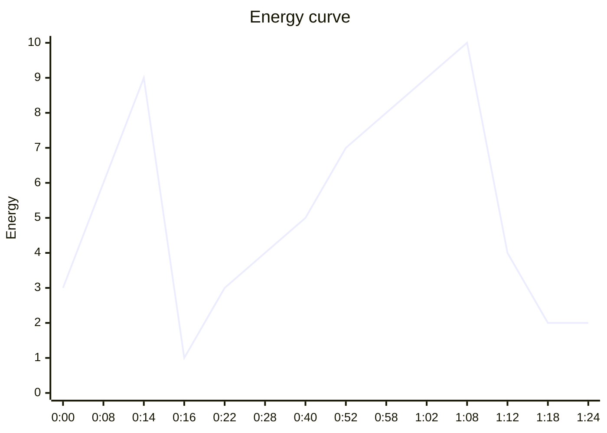

# Zenboard Launch Film — Direction v2

Sep 25, 2026 · @divya

## 0. Why v1 fell flat, and what v2 changes

The v1 build (zenboard\_1.mp4) did what the first direction asked: it was consistent and clean. But it was too safe. It reads as a calm slideshow, not a launch. v2 keeps the brand system (Geist, burgundy, Zenboard Pink, the category colours) and throws away the flat, static staging.

| What was wrong in v1 | Why it happened | v2 answer |
| --- | --- | --- |
| The UI is tiny and mostly empty | Windows sit at 40–60% of the frame with wireframe-level content | UI fills 70–90% of the frame, with real, dense, believable data. Macro close-ups at 2–3× show detail. |
| It feels like slides | Every scene enters, holds and leaves in place on a flat cream page | One continuous camera travels through a 3D space. The UI is a physical material that unfolds, docks and transforms. |
| No tension in the problem | The chaos was a tidy grid of grey boxes | Act 1 is dark, fast and dense: windows in real depth, multiplying, notification pressure, tangled threads |
| No wow moment | Level-3 effects were banned outright | Two hero moments built in Three.js and shaders, used only where the story peaks |
| Text sits on top of the film | Captions placed beside visuals | Voiceover drives the timeline, and type emerges from the UI and the objects |
| Transitions don't teach anything | Crossfades and pushes between modules | Every transition is cause → transformation → consequence: the same object carries us into the next scene |
| Illustrations felt like a different film | Storybook founder scenes bookending a UI film | Illustrations only live inside the product (Life cards). The founder becomes the cursor and the voice. |

**What stays from v1:** Geist only, Deep Burgundy instead of black, Zenboard Pink as the brand light, category colour pairings, one magenta accent withheld until the reveal, no serif, no italics.

## 1. Core concept: The Thread

**Zenboard turns everything you do into one connected flow.** We make that idea physical: a single filament of Zenboard Pink light, **the Thread**, that links one piece of work to the next.

- **Before Zenboard** there are many threads, but they are grey, tangled and broken. They connect nothing. They snap as you switch apps.
- **At the reveal**, the tangle is pulled taut into one pink line. The chaos reorganises along it.
- **Inside the product**, the Thread is how the camera travels. It leaves a task, runs to the project, the calendar, the doc, the client, the invoice. We never cut between features; we follow the Thread.
- **In the hero moment**, every module hangs on the Thread in 3D space, with information flowing along it as light. Then it all folds into one workspace.
- **At the end**, the Thread comes to rest as the underline beneath one word: *business*.

### The one object we follow

One job carries the whole film: **"Acme Studio: rebrand proposal."** In Act 1 it is scattered across eight apps. In Act 3 it is born as a task and becomes a project, an event, a doc, a client update and a paid invoice. Because the viewer tracks the same object, every transition explains a real product relationship without a single feature label.

### Emotional arc

Curiosity → Tension → Release → Discovery → Momentum → Awe → Calm. The film should leave people thinking "I want to use this", not "nice animation".

### The question for every shot

What should the viewer feel, understand and notice right now? If a shot can't answer that in one sentence, simplify it.

## 2. The look

### Two lighting worlds, one space

The film takes place in one continuous 3D space. What changes is the light. That gives us the drama of dark, glowing scenes and the calm of daylight, while it still feels like one place.

| World | When | Background | Light | Mood |
| --- | --- | --- | --- | --- |
| Night | Act 1, Act 5 | Deep Burgundy #280417 at centre, falling to a darker shade of it (#16020D) at the edges. Never neutral black. | Cold, hard notification glows; a thin Dusty Rose #A94A72 haze; later the Thread's pink emission | Pressure, then awe |
| Dawn | Act 2 | Burgundy lifting through Blush #F3D9E5 to Warm Cream #F7F1E8 | A single pink light source (the mark) that grows into soft daylight | Release |
| Day | Acts 3, 4, 6 | Warm Cream #F7F1E8 studio space with a soft floor shadow plane | A large soft key light from the top-left, Blush bounce light from below, subtle ambient occlusion under panels | Clarity, calm, confidence |

The dark world is not the old black-and-magenta look. It is always lit, always burgundy, always has depth haze and a visible light source. Flat black never appears.

### Colour

The brand palette from v1 stands, with one addition: light is now a colour. Zenboard Pink is used as an emissive light source (the Thread, the mark, the "Paid" pulse), not just as a fill. Category pairings from v1 colour each module and its Thread nodes. Before the reveal, the app windows are desaturated: burgundy line and Soft Sand, lit only by cold notification glows.

### UI fidelity: the product must look real and rich

This is the biggest change from v1. Zenboard is the hero, so the UI must hold up in close-up.

1. **Real content everywhere.** Real names, real amounts, real times, 6–12 rows per list. No skeleton bars, no lorem, no grey placeholder blocks. One consistent dataset across the film: Acme Studio, Lumen Co., Mara (client), "Rebrand proposal", $1,875 invoice, and so on.
2. **Big on screen.** A wide product shot fills 80–90% of frame width. A feature shot frames one panel at 60–70%. Macro shots frame a single component (a checkbox, a chip, a button) at 2–3× scale with shallow depth of field.
3. **Material, not screenshot.** Each panel is a physical surface: 20px radius, a 1px inner top highlight (white at 70%), a hairline border (burgundy at 8%) and a three-layer burgundy-tinted shadow (contact, ambient, far). In the Night world, panels get a 1px pink rim light on the edges facing the light.
4. **Hierarchy inside the UI.** In every product shot, one element is active (full contrast, lit). The rest of the UI sits at 70% contrast with a slight depth blur. The viewer always knows where to look.
5. **The UI needs a proper film kit.** Rebuild the Zenboard screens as a dedicated high-fidelity component kit for the film, rather than reusing the v1 simplified windows. Build them at 2× resolution so macro shots and 4K renders stay sharp.

### Typography

Geist for words, Geist Mono for data (times, amounts, counters, keyboard hints). Both are part of the Geist family.

| Role | Size at 1080p | Weight | Tracking | Behaviour |
| --- | --- | --- | --- | --- |
| Hero word | 180–240px | Semibold | -4% | Lives in 3D space, has depth and light falloff |
| Statement | 96–120px | Medium | -3% | Synced to the voiceover word by word |
| UI in close-up | as UI × camera scale | Regular / Medium | 0% | Part of the product; never faked |
| Data | 18–28px | Geist Mono Regular | 0% | Counters roll, amounts tick |

**Type is part of the scene, not a caption.** Words emerge from the UI (a task title lifts out of its row and scales into a statement), attach to objects and follow them, split along the Thread, and dissolve back into the interface. A word appears on screen on the exact frame the voice says it.

## 3. Motion system: "precise physics"

Everything in the film obeys the same physical rules: objects have mass, respond to the user, and come to rest precisely. The motion should feel fast, intelligent and calm. It should never feel bouncy, floaty or random.

### Physics presets (the only curves in the film)

| Preset | Definition | Feel | Used for |
| --- | --- | --- | --- |
| Respond | Spring, starting at stiffness 220, damping 28, mass 1. Tune to ≤2% overshoot, settle in 400–500ms. | Physical, precise, tiny life at the end | UI objects: cards docking, chips snapping, panels unfolding |
| Glide | Bezier 0.65, 0, 0.35, 1 | Heavy camera with inertia | All camera moves |
| Whip | Bezier 0.16, 1, 0.3, 1, 250–400ms, with motion blur | Decisive speed | Fast camera snaps in Acts 1 and 4 |
| Depart | Bezier 0.7, 0, 0.84, 0 | Accelerates away | Exits; always faster than the entrance |
| Settle | Bezier 0.22, 1, 0.36, 1 | Soft landing | Type, light changes, atmosphere |

Any spring outside the Respond preset is not allowed. Overshoot is only allowed on UI objects, never on the camera or type.

### Hierarchy in time

The most important object moves first; everything else reacts to it. At 60fps:

| Tier | Starts at | Example |
| --- | --- | --- |
| 1 · Lead | frame 0 | The card being dragged |
| 2 · Response | +4 frames | The column it lands in makes room |
| 3 · Consequence | +8 frames | The counter updates, the Thread lights up |
| 4 · Environment | +16 frames | Light and shadow shift, background eases |

Never more than three tiers moving at once. Nothing moves simultaneously just because it can.

### Depth system

Every shot is built from the same z-layers, so depth feels consistent across the film.

| Layer | Z position | Contents | Blur |
| --- | --- | --- | --- |
| Foreground | +200 | Cursor, statements in 3D, passing particles | Sharp or large bokeh |
| Interaction | +40 | The active element, lifted from its panel | Sharp |
| Primary UI | 0 | The main panel | Sharp |
| Secondary UI | -300 | Related panels | Slight depth blur |
| Background | -1200 | Distant panels, Thread segments | Strong blur |
| Atmosphere | -3000 | Shader haze, light gradients, grain | n/a |

Objects approach the camera by moving in real z-space, never by fake 2D scaling.

### Opacity, blur and scale rules

- **UI never fades in from nothing in the Day world.** Every panel arrives from somewhere: it unfolds from a parent, is carried by the Thread, or docks from off-frame. This is what keeps the spatial logic readable.
- **Opacity** is for type, light and atmosphere.
- **Depth of field** does the focusing. Rack focus between layers over 12–20 frames to shift attention.
- **Motion blur** at a 180° shutter, only on Whip moves and fast objects.
- **Scale** changes on objects stay between 96% and 104%, except morphs, where one component becomes another.

### Cursor

The cursor is the founder's hand, so it must feel human.

- Moves on a slight arc, never a straight line, using a Glide curve over 300–600ms.
- On long moves, it overshoots its target by 3–6px and corrects over 6 frames.
- On hover, the target lifts 2px, its shadow grows and it brightens.
- On press, the cursor scales to 90% for 5 frames and the target compresses by 2%; on release, a soft pink ripple spreads 12px.
- It rests still between actions and never jitters or idles in circles.

### Micro-interaction library

| Interaction | Response |
| --- | --- |
| Create | The new row slides open with Respond; a thin pink line draws under it, then fades |
| Complete | The checkbox fills from the centre and the tick draws on; the row text dims to 55% in one smooth pass; a tiny particle burst in the category colour (6–8 particles, 10 frames) |
| Drag | The card lifts to z +40, tilts 2° in the direction of travel, its shadow widens and softens |
| Drop | The target zone opens space first (tier 2), then the card settles with Respond; the shadow tightens |
| Delete | The row compresses vertically to 0 while its neighbours close the gap; a faint horizontal line remains for 4 frames |
| Loading / AI | A shimmer runs along the element's border in pink, left to right, once |
| Scroll | Momentum scrolling with a soft stop; headers stick with a hairline shadow |
| Expand / collapse | Content unfolds from its source edge like paper, with light catching the fold |

### Camera vocabulary

Each shot type has one job.

| Shot | Lens feel | Job |
| --- | --- | --- |
| Macro | 100mm, very shallow focus | Make one interaction feel tactile |
| Feature | 50mm | Show one module clearly |
| Wide | 35mm | Show relationships between panels |
| Thread follow | Tracking along the Thread | Carry the viewer from one feature to the next |
| Push-in | Slow dolly forward | Enter something: a project, a doc |
| Orbit | 30–90° around a subject | Reveal dimensionality, used only in the hero moment |
| Locked | Still | Let an interaction land. At least 20% of product shots are locked. |

### Effect levels

| Level | What | How often |
| --- | --- | --- |
| 1 · Product motion | UI interactions, transformations, cursor | Always |
| 2 · Cinematic | Depth of field, lighting, motion blur, haze, shadows | Most shots, subtly |
| 3 · Hero | Shaders, particles, 3D transformations | Only three moments, about 15% of runtime: the freeze (end of Act 1), the reorganisation (Act 2) and the constellation (Act 5) |

## 4. Structure and pacing

Six acts, 1:24, one continuous camera. The music runs at 120 BPM (one beat = 30 frames at 60fps, one bar = 2s), with half-time feel in the slow acts.

| Act | Time | Pace | World | The viewer should feel | The viewer should understand |
| --- | --- | --- | --- | --- | --- |
| 01 · The Problem | 0:00–0:16 | Fast, accelerating | Night | Pressure, recognition ("that's me") | Running a business means juggling too many disconnected apps |
| 02 · The Shift | 0:16–0:28 | Slow | Night → Dawn | Relief | Zenboard brings it all into one connected system |
| 03 · The Product | 0:28–0:52 | Medium | Day | Curiosity, clarity | Tasks, projects, calendar, docs, clients and invoices are all linked |
| 04 · The Flow | 0:52–1:02 | Fast | Day | Momentum, satisfaction | Working in Zenboard is effortless and quick |
| 05 · The Hero | 1:02–1:12 | Very fast, then awe | Night (lit by the Thread) | Excitement, "how did they make that?" | Everything you run, connected in one place |
| 06 · The End | 1:12–1:24 | Slow | Day (evening) | Calm, desire | Zenboard: the single platform for work, life and business |



Two deliberate drops shape the film: total silence at 0:16 after the chaos peaks, and the settle at 1:12 after the hero peak. These contrasts are what make the fast sections feel exciting.

## 5. Shot-by-shot script

The voiceover directs the timeline. Every bold word in the VO column has a visual action on the same frame. Effect level (L1–L3) refers to section 3.

### Act 01 · The Problem (0:00–0:16) · Night · fast

| Shot | Time | VO | Visual and motion | Transition (cause → consequence) | Sound | FX |
| --- | --- | --- | --- | --- | --- | --- |
| 1.1 | 0:00–0:02 | (none) | Macro, near darkness. One cold notification glow blinks on. Rack focus reveals an unread badge, "3", on the corner of an app window. | The badge's glow pulls focus and the camera back | A single soft ping in silence | L2 |
| 1.2 | 0:02–0:05 | You started a business to do **the work you love**. | Glide pull-back: the window is a Tasks app floating in haze. On "the work you love", that phrase is highlighted as a task title inside it; it's buried under 11 other tasks. Two more windows fade up in depth behind. | The highlight dims, the task scrolls away under new items | Room tone, low pulse starts | L1–2 |
| 1.3 | 0:05–0:10 | Instead, you're running it across **eight** different apps. | On "eight", windows multiply to eight generic apps (tasks, projects, docs, notes, calendar, invoices, CRM, planner) placed at different depths from z −1200 to z +40. Whip moves between them on each beat. Grey threads stretch between windows but connect nothing. A Geist Mono counter docks at the bottom: 8 apps · 8 logins · 8 bills. | Each whip lands on a window as a new notification hits it | Whooshes on each whip, notification pings stacking | L2 |
| 1.4 | 0:10–0:14 | Retyping **the same client**. Chasing **the same invoice**. Switching. **Again.** | Half-beat montage: "Acme Studio" is typed into the CRM, the calendar, the invoice, the doc; the same highlight in each. Windows now overlap in depth (never flat-on collisions). The threads tangle tighter and snap one by one. On "Again", the word hits in 3D at z +200, Semibold 220px, then the camera flies straight through it. | Flying through "Again" pushes us into maximum density | Keyboard clatter, drone rising, thread snaps, heavy riser | L2–3 |
| 1.5 | 0:14–0:16 | (silence) | **Freeze.** Every window, particle and half-slid notification stops mid-motion. The camera alone keeps drifting, very slowly, through the frozen scene (bullet time). A faint chromatic shimmer on the frozen edges. | Stillness creates the space for the reveal | Hard cut to silence; only a low air tone | L3 |

### Act 02 · The Shift (0:16–0:28) · Night → Dawn · slow

| Shot | Time | VO | Visual and motion | Transition | Sound | FX |
| --- | --- | --- | --- | --- | --- | --- |
| 2.1 | 0:16–0:19 | What if it all **connected**? | Deep in the frozen space, a single point of Zenboard Pink light ignites. Light rays spill between the frozen windows; each catches a pink rim light. On "connected", every grey thread turns toward the light. | The light becomes a gravitational centre | One deep, soft tone swells | L3 |
| 2.2 | 0:19–0:24 | Meet **Zenboard**. | The threads pull taut into one straight pink line: the Thread. Windows are drawn along it toward the light. As each crosses the light, it dissolves into particles (shader) and reassembles as a clean Zenboard module card in its category colour. The background dawns from burgundy through Blush to Warm Cream. On "Zenboard", the light resolves into the mark and the wordmark settles beside it. | Chaos becomes structure in front of the viewer | Particles hiss softly; the Zenboard two-note chime on the word | L3 |
| 2.3 | 0:24–0:28 | One connected workspace for **your work**, **your business** and **your life**. | The eight module cards fly into formation and dock as the rows of a sidebar. A full Zenboard window assembles around them; the mark travels into its logo slot. On each bold phrase, one row lights: Today, Money, Life. Slow push-in toward the Today view. | Docking the cards builds the product; the push-in enters it | Music enters: warm, pulsing, 120 BPM half-time | L1–2 |

### Act 03 · The Product (0:28–0:52) · Day · medium

One continuous Thread-follow shot. The camera never cuts; it follows "Acme Studio: rebrand proposal" through the product.

| Shot | Time | VO | Visual and motion | Transition | Sound | FX |
| --- | --- | --- | --- | --- | --- | --- |
| 3.1 | 0:28–0:32 | It starts with **a task**. | Macro on quick-add. The cursor clicks in and types "Rebrand proposal for Acme". Enter: the row slides open, a pink line draws beneath it. The text "#Acme" auto-links into a project chip (tier 2). | The chip sparks and a Thread emerges from it | Light keystrokes, a soft create sound | L1 |
| 3.2 | 0:32–0:36 | That becomes part of **a project**. | The task card lifts to z +40 and travels along the Thread. The camera follows laterally to the Acme project board, full of real cards. The "In progress" column opens space and the card docks with Respond. | The dock pulses the Thread onward | Paper slide, soft dock | L1–2 |
| 3.3 | 0:36–0:40 | It finds its place **on your calendar**. | The week calendar unfolds from the board's edge like paper. The cursor drags the card to Thursday 10:00; it morphs into a pink event block and its handle stretches to two hours. | The event glows; the camera pushes into it | Drag and snap sounds | L1–2 |
| 3.4 | 0:40–0:44 | Your docs live **right next to the work**. | Push-in: the event expands into the proposal doc. The H1 "Acme: rebrand proposal" is there; two lines type live. A linked task chip sits in the text. | Typing "@Mara" creates a client chip | Quiet typing | L1 |
| 3.5 | 0:44–0:48 | Your clients see **progress**. | The @Mara chip expands into the Acme client portal. The progress bar fills to 64%. Mara's avatar appears with an "Approved" comment. | Approval triggers the time log | Soft rising tone | L1–2 |
| 3.6 | 0:48–0:52 | And the hours become an invoice. **In one click.** | Three time rows (3.0h, 5.0h, 2.5h) compress and stack into one invoice card for $1,875. The cursor clicks Send. Macro on the status pill: Sent → **Paid**. A pink pulse travels backward along the Thread through the portal, doc, event, project and task, lighting each once. | The pulse proves everything is connected; the camera pulls to a wider view | The Zenboard chime (single note) on "Paid" | L2 |

### Act 04 · The Flow (0:52–1:02) · Day · fast

Locked macro shots cut on the beat and match-cut on shape: every shot's key shape sits where the last one ended.

| Shot | Time | VO | Visual and motion | Sound | FX |
| --- | --- | --- | --- | --- | --- |
| 4.1 | 0:52–0:54 | **Create.** | ⌘K palette opens with Respond; "New project" is picked. The word "Create" rises out of the palette's input. | Keycap tick | L1 |
| 4.2 | 0:54–0:56 | **Plan.** | A task drops into tomorrow's lane; a recurring toggle flips on. "Plan" emerges from the calendar header. | Snap | L1 |
| 4.3 | 0:56–0:58 | **Write.** | A note captures itself in two keystrokes, auto-linked to the project. | Keys | L1 |
| 4.4 | 0:58–1:00 | **Send.** | A second invoice goes out; a habit streak ticks to 12; a focus timer ring starts. The circle shapes match-cut into each other. | Three quick ticks | L1 |
| 4.5 | 1:00–1:02 | **Done.** | The last checkbox of the day fills; "0 left" appears in Geist Mono. A small burst in each category colour. | A satisfying, clean click, then the music lifts | L1–2 |

### Act 05 · The Hero (1:02–1:12) · Night · very fast, then awe

| Shot | Time | VO | Visual and motion | Transition | Sound | FX |
| --- | --- | --- | --- | --- | --- | --- |
| 5.1 | 1:02–1:05 | **Everything** you run… | Whip pull-back from the Today view. The window splits along its seams, like an exploded product diagram, into its modules. They drift out into 3D space as the world falls back to Night and the Thread becomes brightly luminous. | The explosion reveals how the product is built | A deep whoosh and sub-bass swell | L3 |
| 5.2 | 1:05–1:09 | …**connected**. | A 90° orbit around the constellation: eight module panels hang at different depths along a sweeping helix of the Thread. Streams of particles in category colours flow along it between modules (task to project to calendar to invoice). Bloom and deep depth of field. | Speed builds, then everything aligns | Rising arpeggio, shimmering high end | L3 |
| 5.3 | 1:09–1:12 | **In one place.** | Every panel rotates and slides back into one seamless workspace in a single fluid move, landing flat to camera exactly on "place". The Thread snaps into the sidebar's active line. | The landing is the full stop | Sub-bass impact on "place", then near silence | L3 |

### Act 06 · The End (1:12–1:24) · Day (evening) · slow

| Shot | Time | VO | Visual and motion | Sound | FX |
| --- | --- | --- | --- | --- | --- |
| 6.1 | 1:12–1:18 | (pause) | Locked camera. Warm evening light across a clean Today view: "All done for today." The cursor moves slowly to the one remaining Life item, "Leave at 6", and checks it. Then the camera eases back, and the window recedes into the cream space. | Soft room tone, a single warm click | L1–2 |
| 6.2 | 1:18–1:24 | **Zenboard.** The single platform to manage **work**, **life** and **business**. | The mark and wordmark settle centre-frame. The tagline rises word by word, each bold word landing as it's spoken. The Thread draws once beneath "business" and comes to rest. "Available today" appears below. Hold for 2s. | The Zenboard chime resolves; music ends on a held chord | L1 |

## 6. Hero effects: how each one is built

Every effect below exists for a story reason. All of them run in Three.js (React Three Fiber inside Remotion). All motion is a function of the frame number, so renders are deterministic.

| # | Effect | Shots | Why it exists | How it's built |
| --- | --- | --- | --- | --- |
| E1 | Atmosphere haze | Night world | Gives the dark world depth and light so it never reads as flat black | A full-screen plane at z −3000 with an fbm-noise fragment shader tinted Dusty Rose at 6–10% intensity, drifting slowly. Light rays in Act 2 come from a radial-blur post pass centred on the light's screen position. |
| E2 | The threads | 1.3–1.4, 2.1–2.2 | Shows disconnection, then connection | Each thread is a CatmullRomCurve3. The tangled state offsets its control points with curl noise; a `taut` uniform eases the offsets to zero. Rendered as a screen-space-width line (MeshLine or Line2), grey → Zenboard Pink as it tightens. Snaps split the curve and recoil both ends with Respond. The pink Thread uses selective bloom. |
| E3 | Freeze | 1.5 | The silence before the reveal | Scene time and camera time are separate. At the freeze, scene time is held constant while camera time keeps running, so the camera drifts through a frozen moment. A 0.3–0.6px chromatic offset pass shimmers on edges. |
| E4 | Dissolve and reassemble | 2.2 | Chaos turning into structure | Each messy app window becomes around 120k points. Every point stores a source position and colour (sampled from the messy window texture) and a target position and colour (sampled from the clean Zenboard card texture). The vertex shader mixes source to target with a per-point delay that sweeps across the window, so the change reads as a wave passing through the light. Curl-noise displacement peaks mid-transition (amplitude × sin(π × progress)). The solid textured plane is swapped for points on the first frame and back to a crisp card on the last. |
| E5 | Dawn | 2.2–2.3 | Emotional release | Background gradient, fog colour, light temperature and exposure are all driven by one `dawn` uniform from 0 to 1 using Settle, so every lighting value changes together. |
| E6 | Exploded view | 5.1 | Reveals the product's structure | The Today view is split into module planes with their UI as textures. One frame before the split, a thin line of light runs along each seam. Each plane moves to its constellation position with its own small delay, staggered by hierarchy. |
| E7 | Constellation flow | 5.2 | Information flowing through one system | The Thread becomes a helix curve through all eight panels. Particle packets (small rounded quads, instanced) travel along it using `getPointAt((t + offset) % 1)`, coloured by the module they're leaving, with additive blending and short trails. Bloom, plus depth of field focused on the nearest panel. |
| E8 | Fold into one | 5.3 | The whole promise in one motion | The reverse of E6, with the camera dollying to a flat, head-on view. Its final frame matches the DOM Today view pixel for pixel, so the switch back to the crisp UI is invisible. |
| E9 | Depth of field in UI shots | Acts 3–4 | Directs the eye | In DOM scenes, each z-layer gets a CSS blur proportional to its distance from the focus layer, animated for rack focus. It's cheaper than WebGL and keeps the UI text crisp. |
| E10 | Grain and vignette | Whole film | Cohesion and a filmic finish | One post pass: animated grain at 3% (seeded by frame) and a 10% vignette tinted burgundy, never black. |

### The seamless handoff rule

Most of Acts 3, 4 and 6 is DOM (crisp React UI). Acts 1, 2 and 5 are WebGL. Every switch between them happens on a frame where the panel is flat to camera, at identical position and scale, with the UI texture captured from the same React component. The viewer should never see the join.

## 7. Sound and voiceover

Sound makes the interface physical. Each act has its own sonic texture, and two near-silences carry as much weight as the loudest moments.

### Voiceover

A calm, warm, close-mic voice, like a founder speaking to another founder: confident, never salesy. Record it first, then lock the edit to it, because the VO sets the frame for every visual action.

Full script (about 70 words):

> You started a business to do the work you love. Instead, you're running it across eight different apps. Retyping the same client. Chasing the same invoice. Switching. Again.
>
> What if it all connected? Meet Zenboard. One connected workspace for your work, your business and your life.
>
> It starts with a task. That becomes part of a project. It finds its place on your calendar. Your docs live right next to the work. Your clients see progress. And the hours become an invoice. In one click.
>
> Create. Plan. Write. Send. Done.
>
> Everything you run, connected. In one place.
>
> Zenboard. The single platform to manage work, life and business.

After recording, mark every bold word from section 5 with its exact frame in a `vo-markers.json` file. The code reads those markers, so visual actions snap to the voice automatically.

### Music

120 BPM. Act 1: no melody, just a pulse and rising tension. Act 1 ends in a hard cut to silence. Act 2: one sustained, warm tone, then the music enters. Act 3: a warm, clean groove at half-time. Act 4: full time, tight and percussive. Act 5: a build into one large, resolved hit on "place". Act 6: a sparse outro ending on a held chord. Library search terms: "cinematic tech minimal", "warm electronic product launch", "pulse build resolve".

### SFX by act

| Act | Palette |
| --- | --- |
| 01 | Notification pings (slightly detuned and stacking), whooshes on each whip, keyboard clatter, dry thread snaps, a heavy riser, then a hard cut |
| 02 | Air, one deep swell, a soft particle hiss, the Zenboard chime |
| 03 | Soft keystrokes, paper slides for unfolding, gentle snaps on dock and drop, the chime (single note) on "Paid" |
| 04 | Tight tactile clicks on each beat, one per interaction |
| 05 | Deep whoosh, sub-bass swell, shimmering high-end arpeggio, a large sub-bass impact on "place" |
| 06 | Room tone, one warm click, the chime resolving |

### The Zenboard chime

A two-note rising major second on a soft mallet or glass tone. It is played at the reveal, on "Paid" and at the end. Keep it consistent so it becomes a brand sound.

Mix at -14 LUFS integrated, -1 dBTP. Duck the music by 4 dB under the VO. Check everything on phone speakers.

## 8. Image generation prompts

In v2 the product and the effects are built in code, so generated images do supporting work: atmosphere references, content that makes the UI feel real, and the illustrations that live inside the product. The storybook founder scenes from v1 are dropped.

### Illustration house style (for assets that appear inside the UI)

```
Minimal editorial flat illustration. One uniform line in deep burgundy #280417 on warm cream #F7F1E8. Flat fills using only the colours listed at the end of the prompt: one or two dominant colours and one accent. Generous negative space, calm, simple geometric forms, flat 2D, no shading, no gradients, no text.
```

Negative prompt for all illustration assets: `3D, photorealistic, gradients, glossy, neon, pure black, grey, colours not listed, text, letters, logos of real brands, clutter, sketchy lines`

### Prompts

| Code | Use | Prompt | Format |
| --- | --- | --- | --- |
| V2-01 | Look reference for the Night world (E1) | Cinematic dark atmospheric space, deep burgundy #280417 fading to a darker burgundy at the edges, soft volumetric haze in dusty rose #A94A72, faint floating dust particles, one distant soft pink #C41C72 light source glowing through haze, shallow depth, film grain, no objects, no text. (No house style: this is a mood plate.) | 16:9, 3840 × 2160 |
| V2-02 | Look reference for Dawn (E5) | The same space at dawn: haze lifting, burgundy transitioning through blush #F3D9E5 into warm cream #F7F1E8, soft pink light blooming from the centre, airy and calm, no objects, no text. (No house style.) | 16:9, 3840 × 2160 |
| V2-03 | Chaos app icons (Act 1, eight windows) | House style. A single generic app icon, rounded square tile, flat, showing \[subject\], centred. Subjects: checklist, kanban columns, document page, sticky note, calendar grid, receipt, address book card, sun and leaf. Colours: linework #280417, dominant Soft Sand #E8D8C5, accent Muted Apricot #E8B88A. No real brand likeness. | 1:1, 1024 × 1024 each |
| V2-04 | Avatars in the product (Mara, clients, team) | House style. A head-and-shoulders avatar portrait in a circle, simple silhouette with hair shape and clothing, no facial features. Six variants with varied hairstyles, skin tones and clothing. Colours per avatar: linework #280417, one dominant from \[Soft Coral #D97A72, Sage #9BAF88, Dusty Blue #8FAFC4, Soft Lavender #AAA0D4, Muted Apricot #E8B88A, Soft Rose #E8A8C5\], accent Blush #F3D9E5 background. | 1:1, 512 × 512 each |
| V2-05 | Fictional client logos (Acme Studio, Lumen Co., Northwind, Fieldhouse) | A simple, modern, flat geometric logo mark for a small design studio called \[name\], single colour deep burgundy #280417 on warm cream #F7F1E8, minimal, vector style, no gradients. | 1:1, 1024 × 1024 each |
| V2-06a–d | Life cards in the product (deep work, walk, dinner, day off) | Reuse the v1 IMG-06a–d prompts and colour pairings unchanged. | 1:1, 2048 × 2048 each |

V2-01 and V2-02 are references for tuning the shaders. The final atmosphere is generated in code, so it can move and respond to light.

## 9. Building v2 in Claude Code

### Stack

- **Remotion** for the timeline, rendering and audio.
- **@remotion/three** with React Three Fiber and drei for the 3D scenes.
- **@react-three/postprocessing** for bloom, depth of field, grain, vignette and chromatic aberration.
- **Custom GLSL** for the haze, the particle morph and the thread glow.
- **Geist and Geist Mono** loaded before the first frame renders.

### Project structure

```
src/
  brand/        tokens.ts, physics.ts (Respond spring, Glide, Whip, Depart, Settle), depth.ts (z-layers)
  data/         acme.ts: the single dataset (clients, tasks, events, hours, invoices, avatars)
  ui/           the high-fidelity film UI kit: Sidebar, TaskRow, QuickAdd, Board, Calendar,
                Doc, ClientPortal, Invoice, CommandPalette, Cursor, micro-interactions
  gl/           Atmosphere, Thread, ParticleMorph, Constellation, UIPlane, PostFX
  shaders/      haze.frag, morph.vert, morph.frag, thread.frag
  timeline/     vo-markers.json, beats.ts, at('connected') → frame helper
  scenes/       Act1 … Act6
  Root.tsx      Film16x9, Film9x16, Cut30, Cut15, textures (still compositions)
scripts/
  textures.ts   renders each UI state as a 2× PNG for the WebGL planes
public/
  textures/  img/  audio/
```

### Key technical rules

1. **Deterministic animation.** Every value derives from `useCurrentFrame()`. Never use R3F's `useFrame`, `Math.random()` or clock-based uniforms; use Remotion's seeded `random(seed)`. Otherwise frames render differently in parallel and the output flickers.
2. **One UI source.** WebGL planes use textures rendered from the same React UI components (`scripts/textures.ts` uses Remotion's `renderStill` at 2×). That's what makes the DOM ↔ WebGL handoff invisible.
3. **VO drives timing.** Scenes never hard-code frames for voice-synced actions. They call `at('word')`, which reads `vo-markers.json`.
4. **Physics only from `brand/physics.ts`.** No inline springs or easings.
5. **Render settings.** WebGL needs `--gl=angle`. Lower `--concurrency` (2–4) for the heavy Night scenes. Master at 1920 × 1080 60fps with `--crf=14`, 4K with `--scale=2`, plus a ProRes 4444 archive.

### CLAUDE.md for v2 (replaces the v1 file)

```markdown
# Zenboard launch film v2 — rules for every session

## Idea
Zenboard turns everything you do into one connected flow. The Thread (a filament of Zenboard Pink light) connects every object. We follow one job, "Acme Studio: rebrand proposal", through the product.
Script, shots and timings: direction doc v2, section 5. Don't invent scenes or copy.

## Brand
- Geist and Geist Mono only. No serif, no italics.
- Deep Burgundy #280417 instead of black everywhere. Never pure black, never neutral grey.
- Warm Cream #F7F1E8 is the Day world. Night world is lit burgundy with haze, never flat.
- Zenboard Pink #C41C72 is light: the Thread, the mark, key states. Not before shot 2.1.
- Category pairings from tokens.ts only.

## UI
- Real data from src/data/acme.ts. No skeleton bars, no lorem, no placeholders.
- Product fills 70–90% of frame width in product shots. Macro shots at 2–3×.
- Panels: 20px radius, 1px inner highlight, burgundy hairline, three-layer burgundy shadow.

## Motion
- Only the presets in brand/physics.ts. Overshoot ≤2%, UI objects only.
- Hierarchy: lead at 0, response +4f, consequence +8f, environment +16f. Max three tiers moving.
- UI never fades in from nothing in the Day world; it arrives from a source.
- Camera moves only with a reason. At least 20% of product shots are locked.
- L3 effects (shaders, particles, 3D) only in shots 1.5, 2.1–2.2 and 5.1–5.3.

## Tech
- All animation from useCurrentFrame(). No useFrame, no Math.random, seeded noise only.
- VO-synced actions use at('word') from timeline/.
- DOM ↔ WebGL handoffs happen flat to camera at identical position and scale.
```

### Session plan

| Session | Ask Claude Code to... | Done when |
| --- | --- | --- |
| 1 | Set up Remotion + R3F + postprocessing, add CLAUDE.md, build `brand/` and `data/acme.ts` | A test composition shows tokens, type, physics presets and depth layers |
| 2 | Build the high-fidelity film UI kit | Still frames of every screen look like a real, shipping product in close-up |
| 3 | Load the recorded VO, create vo-markers.json, build a still-frame animatic of all 24 shots | The whole 1:24 plays in sync with the voice |
| 4 | Act 3: the continuous Thread-follow through the product (DOM) | Every transition reads as cause → consequence |
| 5 | Act 4: the beat montage and match cuts | Every cut lands on the beat |
| 6 | GL foundation: Atmosphere, Thread, UIPlane, PostFX, texture script | A Night test scene looks cinematic, with a crisp UI plane in it |
| 7 | Act 1: the problem and the freeze | Tension builds and the freeze lands on silence |
| 8 | Act 2: particle morph, dawn and the product assembly | Chaos visibly becomes structure; the handoff to DOM is invisible |
| 9 | Act 5: exploded view, constellation, fold into one | The landing on "place" is exact to the frame |
| 10 | Act 6, full sound mix, 9:16 and cutdowns, final renders | All compositions render at 60fps without flicker |
