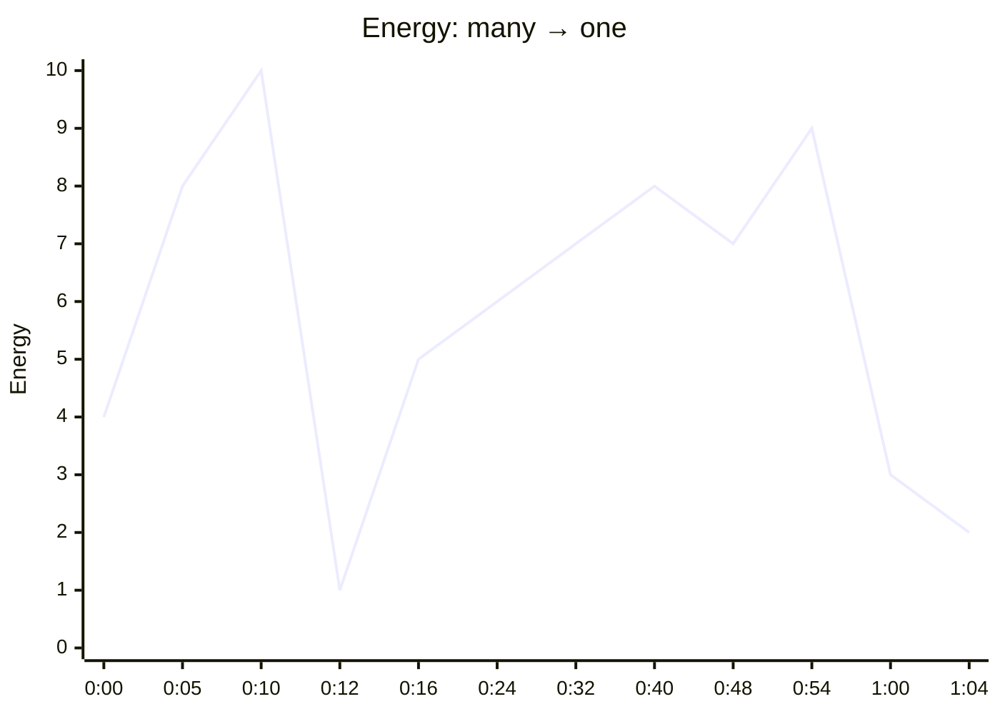

# Zenboard Launch Film — v3: Everything → One

Sep 25, 2026 · @divya

## 0. Clean slate

The latest preview (zenboard-preview-720p.mp4) is the v1 storyboard with a gradient skin. It keeps the same founder illustration, the same 4 × 2 app grid, the same tab strip, the same lines ("So you switch", "And type it all again", "What if it all lived in...") and the same feature-by-feature screens. Because the structure never changed, the film can't feel new however it's styled.

v3 replaces v1 and v2 completely. It's built on a different idea, different scenes and different techniques, drawn from the reference films. It keeps only the brand itself: Geist, the Zenboard palette, the product UI and the tagline.

### Banned from v3

These must not appear in the new build, in any form or restyle:

| Banned | Replaced by |
| --- | --- |
| The founder-at-desk illustrations (morning and evening) | A typographic cold open and a 3D swarm of real UI fragments |
| "Every business starts with one person" / "And one big idea" | "Tasks. Projects. Invoices..." decode sequence |
| The 4 × 2 grid of app windows and the "Eight apps. Eight logins. Eight bills." line | The swarm: hundreds of fragments orbiting in depth |
| The tab strip, ⌘ + Tab pill, "So you switch", "And type it all again" | The "switch" word wall |
| "More time managing work than doing it" | Nothing; the swarm says it visually |
| Eight tiles merging into the mark | The swarm collapsing into a light orb |
| The sidebar rows unfolding one by one | An extreme macro pull-out from inside the UI |
| One screen per feature with a headline above (Plan your day / Write right next to the work / Every client / Invoice in one click / Room for your life) | The node graph: one task branching into everything it touches |
| Floating cards around a sidebar for "All connected" | The orbit rings: work, life, business |
| "One workspace. One subscription. One focus." | The calm word wall collapsing into the logo |
| Full-frame pastel or rainbow gradient backgrounds | Deep burgundy and ivory surfaces; gradient only as light (section 2) |

## 1. Concept: Everything → One

The film is built on one contrast: **the many** (hundreds of scattered fragments of a business) and **the one** (a single, connected workspace). Every scene is either multiplying things or bringing them together, and the viewer feels that rhythm before reading a word.

- **Many:** words decode faster and faster, hundreds of real UI fragments swarm in 3D, a wall of "switch" fills the screen.
- **One:** the swarm collapses into a single point of light, which becomes Zenboard. From then on, everything we see is one system seen from different distances: extreme close-up, full workspace, a living graph of connections, an orbit around the whole.

The film is shorter and punchier than v1/v2: **1:04**, like the references. Short on-screen words carry it, with optional VO.

### Reference DNA: what we take, and how it becomes Zenboard

We borrow techniques, never layouts. Each one is re-authored with the Zenboard palette, Geist and real Zenboard UI.

| Reference | Technique we take | How it becomes original Zenboard | Scene |
| --- | --- | --- | --- |
| together.ai | Text that decodes from scrambled characters; extreme crops deep into the UI | The chaos vocabulary decodes word by word in burgundy darkness; the reveal starts at 800% inside a real Zenboard checkbox | 1, 3 |
| AI image model launch (image swarm) | A swarm of hundreds of images orbiting and collapsing | The swarm is made of real business fragments (invoices, tasks, events, notes) and collapses into Zenboard's light | 1, 2 |
| ElevenLabs agents | Glowing node graph that builds branch by branch; a luminous orb | One task grows a live graph of everything it touches; the orb is Zenboard Pink | 2, 4 |
| Entrives | Bold one-word slams; UI tilted in 3D with a glowing rim | Rim light is Zenboard Pink on a burgundy stage; slams are Geist Semibold | 1, 3 |
| Jurni | A central hub with UI cards orbiting on rings | Three rings named after the tagline: work, life, business | 5 |
| Google Workspace | A repeating word wall; floating UI cards with icons | "switch" wall for chaos, a calm module wall for the ending | 1, 7 |
| Claude Design | Real cursor interactions shot in close-up | The flow montage: tactile macro interactions on the beat | 6 |
| Pinterest motion pins | Soft light blooms and depth | Energy light in the brand gradient, only on key moments | 2, 5, 7 |

## 2. Look v3

### Two stages

| Stage | Colours | Used in | Feel |
| --- | --- | --- | --- |
| Ink | Deep Burgundy #280417 centre to a darker burgundy (#120109) at the edges, with a faint Dusty Rose #A94A72 haze. Type in Warm Cream #F7F1E8. | Scenes 1, 2, 4 | Cinematic, dense, electric |
| Ivory | Warm Cream #F7F1E8 with a soft shadow floor. Type in Deep Burgundy. | Scenes 3 (end), 5, 6, 7 | Clear, premium, calm |

The switch between stages always happens through light (the orb blooming, or a pull-out into daylight), never through a cut or a crossfade.

### Energy light (the only gradient in the film)

A brand gradient built from the palette: **Zenboard Pink #C41C72 → Soft Rose #E8A8C5 → Muted Apricot #E8B88A**, with **Soft Lavender #AAA0D4** as a cool edge. It appears only as light: the orb, rim lights, the glow behind the hub, pulses on the graph, a bloom under the logo. It is never a flat full-frame background. That restraint is what makes it feel premium rather than like the preview's rainbow wash.

### Rim-lit UI

The product UI is the same everywhere, but it is lit like an object.

- **On Ink:** panels are Warm Cream with a 1.5px energy-gradient rim on the edge facing the light, a soft pink bounce on the nearest surface, and a deep burgundy contact shadow.
- **On Ivory:** panels are white with a 1px inner highlight, a hairline burgundy border at 8% and the three-layer burgundy shadow from v2.
- **Hero angle:** UI can tilt up to 18° in 3D in scenes 3 and 5. It is always flat to camera when the viewer needs to read it.
- **Real data only:** the Acme Studio dataset from v2, with dense, real rows. No skeleton bars.

### Giant type

Type is the other main character. Geist Semibold, tracking -5%, sized to dominate the frame.

| Use | Size at 1080p | Behaviour |
| --- | --- | --- |
| Slam words (Everywhere. / Everything connects.) | 240–400px, can crop off the frame edge | Hits on the beat; the camera can fly through it |
| Decode words (Tasks. Projects. ...) | 160px, centred | Scrambles from random Geist Mono glyphs into the word |
| Word wall | 72–96px rows | Rows scroll in opposite directions |
| Statements beside the graph | 56px | Attached to the node they describe, moving with it |
| Tagline | 40px Regular | Rises word by word |

### Motion

The physics presets, hierarchy timing, cursor behaviour and micro-interaction library from v2 section 3 carry over unchanged. What changes is pace: v3 cuts faster in the chaos, and the camera makes fewer but bigger moves.

## 3. The film at a glance

Seven scenes, 1:04, 120 BPM. Each scene has one signature technique, so no two scenes feel the same, but all of them live in one world.

| # | Scene | Time | Stage | Pace | Signature technique | On screen |
| --- | --- | --- | --- | --- | --- | --- |
| 1 | The Noise | 0:00–0:10 | Ink | Fast, accelerating | Decode type → UI swarm → word wall | Tasks. Projects. Invoices. Clients. Notes. Calendar. Docs. → switch × ∞ → **Everywhere.** |
| 2 | The Collapse | 0:10–0:16 | Ink → light | Freeze, then slow | Swarm implodes into an orb; orb becomes the mark | (silence) → **Meet Zenboard.** |
| 3 | The Reveal | 0:16–0:24 | Light → Ivory | One long move | Extreme macro pull-out from 800% into a rim-lit 3D hero shot | Your whole business. → **One workspace.** |
| 4 | The Graph | 0:24–0:40 | Ink | Medium, building | A live node graph grows from one task | A task → becomes a project → lands on your calendar → opens a doc → updates your client → and gets paid. → **Everything connects.** |
| 5 | The Orbit | 0:40–0:48 | Ivory with energy light | Majestic | Three orbit rings around the workspace | **Work. Life. Business.** |
| 6 | The Flow | 0:48–0:54 | Ivory | Very fast, on the beat | Macro cursor montage with shape match-cuts | Plan. Write. Bill. Done. |
| 7 | The One | 0:54–1:04 | Ivory | Slow | A calm module wall collapses into the logo | **Zenboard.** The single platform to manage work, life, and business. Available today. |



## 4. Scene by scene

### Scene 1 · The Noise (0:00–0:10)

**Purpose:** the viewer feels how scattered their business is, before any explanation.

| Beat | Time | What happens | Motion detail | Sound |
| --- | --- | --- | --- | --- |
| 1a | 0:00–0:04 | Ink stage, empty. "Tasks." decodes in the centre from scrambled glyphs. Then Projects. Invoices. Clients. Notes. Calendar. Docs. Each word replaces the last on the beat, getting faster (1 beat → half beat → quarter beat). | Each decode takes 8 frames, resolving left to right. With every word, UI fragments of that type spawn around it in depth: 1, then 4, then 12, then 30. | A digital tick per decode, a low pulse building |
| 1b | 0:04–0:07 | The camera pulls back. The fragments are part of a huge 3D swarm: around 300 real UI pieces (task rows, invoice cards, calendar invites, notes, doc pages, message bubbles, receipts) orbiting a centre in a noisy spherical cloud. Notification badges blink on random fragments. | The swarm rotates slowly as a whole while each fragment has its own orbit speed. Depth of field keeps the nearest fragments sharp, the far ones as bokeh. | Pings stacking, shimmering whoosh as fragments pass camera |
| 1c | 0:07–0:09 | Hard cut to the word wall: rows of "switch switch switch" fill the frame, alternate rows scrolling in opposite directions, accelerating. Every word is Warm Cream at 30% opacity, except the centre row at 100%, so the eye has one line to hold on to. | Rows accelerate from 200 to 2,000 px/s with motion blur | Keyboard clatter layered on the pulse |
| 1d | 0:09–0:10 | Back in the swarm, now violent and dense. **"Everywhere."** slams in at 380px, cropping off both edges. The camera flies straight through the letters into the swarm's core. | Whip move, 20 frames, heavy motion blur | Big riser peaking |

### Scene 2 · The Collapse (0:10–0:16)

**Purpose:** the release. Everything scattered becomes one thing.

| Beat | Time | What happens | Motion detail | Sound |
| --- | --- | --- | --- | --- |
| 2a | 0:10–0:11 | Freeze. Every fragment stops mid-orbit. The camera alone drifts, very slowly. | Scene time held, camera time running | Hard cut to silence |
| 2b | 0:11–0:13 | A single point of Zenboard Pink light ignites at the centre. Every fragment turns toward it, then spirals inward, accelerating, shrinking and glowing brighter as it falls. | Spiral paths tighten; each fragment's emission rises from 0 to 1 as it reaches the centre, staggered by distance | A reversed swell sucking inward |
| 2c | 0:13–0:15 | The last fragment lands. The point has become a glowing orb in the energy gradient, breathing once. Light floods outward and the Ink stage starts warming. | Orb scale 0 → 1 with Respond; bloom peaks then settles | Deep, warm tone; the Zenboard chime |
| 2d | 0:15–0:16 | The orb flattens into the Zenboard mark. **"Meet Zenboard."** rises beneath it. | Orb scale-z goes to 0; crossfade to the SVG mark on the flat frame | Chime tail |

### Scene 3 · The Reveal (0:16–0:24)

**Purpose:** the first look at the product should feel immense and precise.

| Beat | Time | What happens | Motion detail | Sound |
| --- | --- | --- | --- | --- |
| 3a | 0:16–0:18 | Match cut: the mark's centre becomes the centre of a Zenboard checkbox, seen at 800%. We are inside the UI. The cursor, enormous, clicks it. The tick draws on at a huge scale. | Macro depth of field; only the checkbox is sharp | One tactile click, amplified |
| 3b | 0:18–0:22 | One continuous pull-out from 800% to 100%. The checkbox becomes a task row, the row becomes the Today list, the list becomes the full Zenboard workspace with real data. **"Your whole business."** appears in the empty space as the frame widens. Light transitions from Ink to Ivory as we exit. | Glide, 4s, perfectly smooth; UI stays crisp throughout (DOM) | A long, rising air tone |
| 3c | 0:22–0:24 | The pull-out keeps going: the workspace tilts back 18° into a hero angle with a pink rim light, floating over the Ivory floor with a soft shadow. **"One workspace."** | Handoff from DOM to a 3D plane on a flat frame, then the tilt | Music enters |

### Scene 4 · The Graph (0:24–0:40)

**Purpose:** show that everything in Zenboard is connected, without a single feature screen.

| Beat | Time | What happens | Motion detail | Sound |
| --- | --- | --- | --- | --- |
| 4a | 0:24–0:26 | The tilted workspace darkens back to Ink. One task lifts out of it and floats to the centre: "Rebrand proposal · Acme". The workspace falls away. **"A task"** attaches to it. | Task card to z +40, workspace recedes and blurs | Soft lift |
| 4b | 0:26–0:36 | A glowing line grows from the task and branches, like a living diagram. Each time a line reaches a new point, a real Zenboard card unfolds there: the **Acme project** board ("becomes a project"), a Thursday 10:00 **calendar event** ("lands on your calendar"), the **proposal doc** ("opens a doc"), the **client portal** with Mara's "Approved" ("updates your client"), and an **invoice** for $1,875 ("and gets paid"). The camera travels along the lines from node to node. | Lines draw with Settle in 18 frames; the card unfolds from the line's end with Respond; the camera follows the newest line with Glide. Each statement is attached beside its node, 56px. | A soft tone per node, rising in pitch; line draws hum |
| 4c | 0:36–0:38 | "Paid" flips on. A pulse of light runs back through every line to the task in one sweep. | The pulse is the energy gradient, 24 frames end to end | The chime (single note) |
| 4d | 0:38–0:40 | The camera pulls far back. This graph is one of hundreds: a vast network of connected tasks, projects and clients glowing across the Ink stage, like a city at night. **"Everything connects."** slams across it. | Handoff to instanced 3D nodes and lines; a huge Glide pull-back | Wide swell, low impact on the slam |

### Scene 5 · The Orbit (0:40–0:48)

**Purpose:** Zenboard holds your whole world: work, life and business.

| Beat | Time | What happens | Motion detail | Sound |
| --- | --- | --- | --- | --- |
| 5a | 0:40–0:42 | The network's glow blooms to white-cream: we're on the Ivory stage. The Zenboard workspace sits at the centre, softly lit by the energy light behind it. | The bloom covers the stage change | Airy transition |
| 5b | 0:42–0:47 | Three tilted orbit rings appear around the workspace, each carrying real module cards. On **"Work."** the inner ring lights (Tasks, Projects, Docs, Notes). On **"Life."** the middle ring (Habits, Focus, Life calendar, a day off). On **"Business."** the outer ring (Clients, Money, invoices, time). The camera orbits 60° around the whole system. | Rings draw as thin lines, cards travel along them at different speeds; each ring picks up its category colours when named | A rising three-note motif, one per ring |
| 5c | 0:47–0:48 | All three rings align into one plane and spin once. | Glide, the only fast move in the scene | Whoosh |

### Scene 6 · The Flow (0:48–0:54)

**Purpose:** working in Zenboard feels effortless and fast.

Locked macro shots, one per half beat, match-cut on shape. The cursor is enormous and tactile. Shots: ⌘K palette snapping open; a card dragged into a column; a doc heading typed; a time entry turning into an invoice line; Send; a checkbox filling. The words **Plan. Write. Bill. Done.** land one per beat, each rising out of the element being used. Sound: one crisp click per shot, tight to the beat.

### Scene 7 · The One (0:54–1:04)

**Purpose:** a calm resolution that says the whole idea in one move.

| Beat | Time | What happens | Motion detail | Sound |
| --- | --- | --- | --- | --- |
| 7a | 0:54–0:58 | The callback: a word wall again, but calm. Rows of module names (Tasks, Projects, Docs, Notes, Calendar, Money, Clients, Life), each in its category colour, gliding slowly on the Ivory stage. | Slow scroll, 60 px/s, no blur | Music thins out |
| 7b | 0:58–1:00 | All rows slide together and compress into a single row, then a single point of pink light. | Rows converge with Glide; the point glows once | A soft inhale |
| 7c | 1:00–1:04 | The point opens into the Zenboard mark and wordmark. The tagline rises word by word. "Available today" appears below. Hold. | Settle curves only; nothing else moves in the last 2 seconds | The chime resolves; a held final chord |

## 5. Signature techniques: how each is built

Seven techniques, one per scene. Crisp UI and type are DOM; volume, particles and light are WebGL (React Three Fiber). Every value comes from the frame number and seeded randomness, so renders are deterministic.

| Technique | Scene | Built with | Recipe | Quality details that sell it |
| --- | --- | --- | --- | --- |
| Decode type | 1 | ☐ DOM | Each character cycles through random glyphs (seeded per character and frame) and locks in left to right, 1 character per frame, 8 frames per word | Scrambling glyphs use Geist Mono at 60% opacity; locked letters snap to Geist Semibold at 100%. Letters never shift position during the decode. |
| UI swarm | 1 | WebGL | \~300 instanced planes. Textures come from one 4096² atlas of 24 real UI fragments rendered from React components. Each instance has a shell radius, orbit axis, speed and phase; positions on noisy spherical shells, plus a global slow rotation. Instances are revealed by index over time as the words decode. | Each fragment faces the camera within ±25°. Depth of field with real bokeh. Burgundy fog by distance. Notification badges are a separate tiny instanced layer blinking by seed. |
| Word wall | 1, 7 | DOM | Rows of repeated words in overflow-hidden lanes; each lane translates on X with alternating direction; speed follows an ease-in curve in scene 1 and a constant slow speed in scene 7 | Soft edge masks on left and right. Motion blur only in scene 1. |
| Implosion to orb | 2 | WebGL | Same instances as the swarm. A `collapse` uniform drives each fragment along a spiral (angle increases as radius shrinks) to the centre, scaling to 0 while emission rises. The orb is a sphere with a fresnel shader in the energy gradient, plus selective bloom. | Stagger by distance, so the outer shell arrives last. The orb breathes once (scale 1 → 1.04 → 1) before flattening. |
| Macro pull-out | 3 | DOM, then WebGL | The real Zenboard UI rendered at 2× inside a container whose scale goes from 8 to 1 with Glide over 4s; the transform origin sits on the checkbox. At the end, a handoff on a flat frame to a textured 3D plane, which then tilts 18°. | Text stays pin-sharp throughout because it's real DOM. Add a subtle depth blur on rows as they enter the frame edges. |
| Node graph | 4 | DOM + SVG, then WebGL | Nodes are real UI cards on a large 2.5D canvas; edges are SVG cubic curves drawn with stroke-dashoffset; the pulse is a gradient dot moving along the path with getPointAtLength. The camera is a transform on the whole canvas following the newest node. The final pull-back hands off to instanced WebGL nodes and lines (a few thousand) laid out by a seeded force-directed graph. | Edges glow with an energy-gradient stroke and a soft blur copy underneath. Cards unfold from the point where the line arrives, never from their centre. |
| Orbit rings | 5 | WebGL | Three thin ring lines (torus or line loops) tilted at different angles around a central UI plane. Cards are textured planes placed along each ring by angle, billboarded to face the camera. Rings light up in their category colours on cue. | The energy light sits behind the workspace plane as a large soft glow. Cards passing behind the workspace get occluded and blurred. |

### Seamless handoffs

Every DOM ↔ WebGL switch happens on a frame where the element is flat to camera, at identical position and scale, and the WebGL texture is rendered from the same React component. If the viewer can see a switch, the handoff isn't finished.

### Post-processing (the whole film)

Selective bloom on emissive elements only, depth of field in 3D scenes, 3% animated grain, a 10% burgundy vignette. No chromatic aberration except a 0.5px shimmer on the scene 2 freeze.

## 6. Sound

The film is written to work without voiceover; the type carries the words. If you add VO, it says only the on-screen lines, and it drops out entirely in scenes 1 and 6.

| Scene | Music | SFX |
| --- | --- | --- |
| 1 The Noise | Pulse only, accelerating, 120 BPM, no melody | A digital tick per decode, stacking pings, fragment whooshes, keyboard clatter under the word wall, a big riser into "Everywhere" |
| 2 The Collapse | Hard cut to silence | A reversed inward swell, a deep warm tone, the Zenboard chime |
| 3 The Reveal | Music enters on the tilt | One amplified click, a long rising air tone |
| 4 The Graph | Warm, building groove | A soft tone per node rising in pitch, a line hum, a single chime on "Paid", a low impact under "Everything connects" |
| 5 The Orbit | Opens up, majestic | A three-note rising motif, one note per ring |
| 6 The Flow | Tight and percussive, full time | One crisp click per shot, exactly on the beat |
| 7 The One | Thins out to a held chord | A soft inhale, the chime resolving |

The Zenboard chime (a rising major second on a soft mallet or glass tone) plays three times: the orb, "Paid" and the logo. Mix at -14 LUFS, -1 dBTP, and check on phone speakers.

## 7. Image generation prompts

The UI, type and effects are code. Generated images make the product's content feel real (photos inside docs and moodboards, avatars, client logos) and give look references for the 3D scenes.

| Code | Use | Prompt | Format |
| --- | --- | --- | --- |
| V3-01 | Look reference: the swarm (scene 1) | Cinematic dark space in deep burgundy #280417, hundreds of small floating rectangular paper-white cards at many depths forming a loose spherical cloud, shallow depth of field with soft bokeh on distant cards, faint dusty rose haze, a few tiny glowing notification dots, film grain, no readable text, no logos. | 16:9, 3840 × 2160 |
| V3-02 | Look reference: the orb (scene 2) | A single glowing orb of light floating in dark burgundy space, gradient from vivid pink #C41C72 at the rim through soft rose #E8A8C5 to warm apricot #E8B88A at the core, soft bloom, faint light rays through haze, minimal, cinematic, no text. | 16:9, 3840 × 2160 |
| V3-03 | Look reference: the network (scene 4 pull-back) | A vast network of thousands of small glowing nodes connected by thin luminous lines in pink #C41C72 and soft rose #E8A8C5, spread across dark burgundy space like a city seen from above at night, depth fog, shallow focus on the centre, no text. | 16:9, 3840 × 2160 |
| V3-04 | Real content inside the UI: Acme rebrand moodboard (12 images) | Editorial brand photography for a modern design studio's rebrand: \[subject\], soft natural light, warm neutral palette with cream, sand and a hint of deep burgundy, minimal composition, high-end magazine quality, no text, no logos. Subjects: a stack of printed brand guidelines on a desk, a ceramic mug with a simple mark, business cards fanned out, a shop window with a clean sign (no text), fabric swatches in cream and burgundy, an architectural detail in warm light, a hand holding a pen over sketches, a tote bag on a chair, packaging boxes, a studio wall with pinned prints, a laptop on a linen table, a plant in a terracotta pot. | 4:3, 1600 × 1200 each |
| V3-05 | Avatars (Mara and the team) | Reuse the v2 V2-04 avatar prompt. | 1:1, 512 × 512 |
| V3-06 | Fictional client logos | Reuse the v2 V2-05 logo prompt (Acme Studio, Lumen Co., Northwind, Fieldhouse). | 1:1, 1024 × 1024 |
| V3-07 | Life module cards (seen in the orbit) | Reuse the v1 IMG-06a–d prompts and colour pairings. | 1:1, 2048 × 2048 |

The moodboard photos (V3-04) are the most important new asset. They appear in the swarm fragments, the proposal doc and the Acme project, and they make the product look like a real business is using it.

## 8. Rebuilding in Claude Code

The preview became a reskin because Claude Code edited the existing scenes instead of replacing them. Three changes prevent that this time.

1. **Start from a clean scenes folder.** Keep `brand/`, `data/` and the UI components; delete or archive every old scene file. Old scenes left in the repo get reused.
2. **Styleframes before animation.** For each scene, Claude Code first renders 2–3 still frames at 1920 × 1080. You approve the look before any motion is built. A reskin is obvious in a still, so it gets caught in minutes instead of after a full render.
3. **A v3 CLAUDE.md that bans the old film** by name.

### CLAUDE.md v3 (replaces all previous versions)

```markdown
# Zenboard launch film v3 — "Everything → One"

Source of truth: direction doc v3. Seven scenes, 1:04, 120 BPM:
1 The Noise · 2 The Collapse · 3 The Reveal · 4 The Graph · 5 The Orbit · 6 The Flow · 7 The One.
One signature technique per scene (doc section 5). Do not add scenes, copy or techniques.

## Banned (never reuse, restyle or reference)
- Founder / desk illustrations
- The 4×2 app grid, the tab strip, the ⌘+Tab pill
- Lines: "Every business starts with one person", "And one big idea", "Eight apps. Eight logins. Eight bills.",
  "So you switch", "And type it all again", "More time managing work than doing it",
  "What if it all lived in one place", "Plan your day in seconds", "Write right next to the work",
  "Every client in one view", "Invoice in one click", "And room for the rest of your life",
  "All connected. Nothing to switch.", "One workspace. One subscription. One focus."
- Eight tiles merging into the logo; sidebar rows unfolding one by one
- One-feature-per-screen layouts with a headline above the UI
- Full-frame pastel or rainbow gradient backgrounds

## Brand
- Geist and Geist Mono only. No serif, no italics.
- Stages: Ink (#280417 → #120109 with dusty rose haze) and Ivory (#F7F1E8). Never pure black.
- Energy gradient (#C41C72 → #E8A8C5 → #E8B88A, lavender #AAA0D4 edge) is LIGHT only: orb, rims, pulses, glows.
- Real Acme dataset and V3-04 photos in the UI. No skeleton bars, no placeholders.

## Motion and tech
- Physics presets, hierarchy timing and cursor rules from brand/physics.ts (v2 section 3).
- All animation from useCurrentFrame() and seeded random. No useFrame, no Math.random.
- DOM for UI and type; WebGL for swarm, orb, network, orbit. Handoffs on flat, identical frames.
- Selective bloom only on emissive elements. Grain 3%, burgundy vignette 10%.

## Workflow
- Styleframes first: render 2–3 stills per scene and wait for approval before animating it.
- Build one scene per session. Check every scene against the banned list before finishing.
```

### Kick-off prompt for the first session

```
Read CLAUDE.md and the v3 direction doc. Archive every file in src/scenes into archive/v2-scenes and do not import from it again. Then set up the v3 structure: scenes/S1Noise … S7One, gl/ (Swarm, Orb, Network, OrbitRings, PostFX), a UI fragment atlas script, and timeline/beats.ts at 120 BPM. Don't animate anything yet. Render one styleframe per scene as a still (1920×1080) using the look in doc section 2, and show me all seven.
```

### Session plan

| Session | Build | Approve when |
| --- | --- | --- |
| 1 | Structure, archive old scenes, seven styleframes | Each still looks like a new film, not the old one restyled |
| 2 | UI fragment atlas (24 fragments with V3-04 photos, avatars, logos) | Fragments look like a real business's work |
| 3 | Scene 1: decode, swarm, word wall | The swarm feels dense and alive; "Everywhere." hits hard |
| 4 | Scene 2: implosion, orb, mark | The collapse is the most satisfying moment so far |
| 5 | Scene 3: macro pull-out and tilt | The pull-out is one perfect, crisp move |
| 6 | Scene 4: the node graph and network | Every node explains itself; the pull-back gives scale |
| 7 | Scene 5: orbit rings | Work, life and business read instantly |
| 8 | Scenes 6 and 7 | The montage is locked to the beat; the ending is calm |
| 9 | Sound, full render, 9:16 version | 60fps, no flicker, invisible handoffs |
